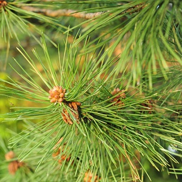

----

&nbsp;

1. General (Non-Normal Distribution) Questions
    1. [Coin Purse](#coin-purse)
    1. [Greenhouse Plants](#greenhouse-plants)
1. Normal Distribution Questions
    1. [Lengths of Pine Needles](#lengths-of-pine-needles)

&nbsp;

&nbsp;

----

## Coin Purse

A coin purse contains 17 nickels and 15 dimes. Use this to answer the questions below.

1. What is the probability of randomly selecting a nickel from this purse?
1. What is the probability of randomly selecting a dime from this purse?
1. What is the probability of randomly selecting a dime from this purse assuming that two nickels and three dimes have already been removed?

[See answer here](zRevExAns/Probability.html#coin-purse)

----

## Greenhouse Plants

A very small green house contains 10 tomato, 12 pea, and 8 cauliflower plants. Use this to answer the questions below. 

1. What is the probability of randomly selecting a tomato plant from this greenhouse?
1. What is the probability of randomly selecting a cauliflower plant from this greenhouse?
1. What is the probability of randomly selecting a pea plant from this greenhouse assuming that all tomato plants had died and were removed from the greenhouse?

[See answer here](zRevExAns/Probability.html#greenhouse-plants)

----

## Lengths of Pine Needles

Suppose that the length of all needles on a particularly large pine tree is known to be normally distributed with a mean of 75 mm and a standard deviation of 8 mm. Use this to answer the questions below.

1. What is the probability that a randomly selected needle is between 70 and 80 mm long?
1. What is the probability that a randomly selected needle is longer than 90 mm?
1. What is the probability that a randomly selected needle is less than 50 mm long?

[See answer here](zRevExAns/Probability.html#lengths-of-pine-needles)

----
