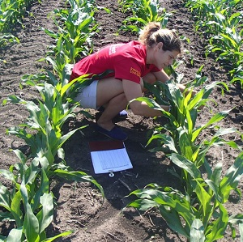

&nbsp;

1. Application Questions with Summarized Results
    1. [Popcorn Yield by Variety](#popcorn-yield-by-variety)
    1. [Heating System Efficiency](#heating-system-efficiency)
    1. [Pork Quality](#pork-quality)

1. Application Questions with Raw Data
    1. [Dioxins in Milk Cartons](#dioxins-in-milk-cartons)
    1. [Low Grades in Math](#low-grades-in-math)
    1. [Hours Worked by Medical Interns](#hours-worked-by-medical-interns)
    1. [Corn Crop Yield](#corn-crop-yield)
    1. [Death Anxiety and Organ Donation](#death-anxiety-and-organ-donation)

&nbsp;

&nbsp;

----

## Popcorn Yield by Variety


A student wanted to determine if the number of unpopped kernels differed between yellow and white varieties of a famous brand of popcorn. To test this, he put 100 kernels of either white or yellow popcorn into a standard air popper, popped the corn until no "pops" were heard, and then counted the number of unpopped kernels. He tested 30 randomly selected groups of 100 kernels for both white and yellow varieties. Use the results below to test, at the 10% level, the student's hypothesis.

```
         Variable  N  Mean  Median  StDev  SE Mean
         White    30 4.267   2.000  4.456    0.814
         Yellow   30 3.567   1.500  4.485    0.819

         Levene's Test -- P-Value = 0.972
```

[See answer here](zRevExAns/2Samplet.html#popcorn-yield-by-variety)

----

## Heating System Efficiency


A study was performed in order to evaluate the effectiveness of two devices for improving the efficiency of gas home-heating systems. Energy consumption in houses was measured after one of the two devices was installed. The two devices were an electric vent damper (DampVent=Electric) and a thermally activated vent damper (DampVent=ThermAct). Energy consumption (in BTUs) was measured for a variety of houses fitted with the two devices. Compare, at the 10% level, the effectiveness of these two devices by determining if a difference exists in energy consumption between houses fitted with the devices. Note that Levene's test p-value is 0.996.

```
DampVent   N    Mean  Median  StDev SE Mean Minimum Maximum     Q1     Q3
Electric  40   9.908   9.590  3.020   0.477   4.000  18.260  7.885 11.555
ThermAct  50  10.143  10.290  2.767   0.391   2.970  16.060  8.127 12.212
```

[See answer here](zRevExAns/2Samplet.html#heating-system-efficiency)

----
## Dioxins in Milk Cartons


A study examined the effectiveness of foil-lined milk cartons to reduce "leakage" of dioxins from the carton to the milk (dioxins were found in milk cartons due to the bleaching process). The dioxin content (parts per thousand, ppt) in milk from 50 unlined and 50 lined cartons of milk are recorded in [MilkCartons.csv](https://raw.githubusercontent.com/droglenc/NCData/master/MilkCartons.csv). Determine, at the 1% level, if lining the cartons with foil significantly reduced the amount of dioxin in the milk.

[See answer here](zRevExAns/2Samplet.html#dioxins-in-milk-cartons)

----

## Low Grades in Math


The University of North Carolina math department is noted for "giving out" low grades. To examine this, the GPA from a random sample of 22 math classes and 29 "other" university classes (from the last year) are in [UNCGrades.csv](https://raw.githubusercontent.com/droglenc/NCData/master/UNCgrades.csv). Determine, at the 10% level, if grades are significantly lower in math than in other classes.

[See answer here](zRevExAns/2Samplet.html#low-grades-in-math)

----

## Hours Worked by Medical Interns


A health commissioner needs to determine if the number of hours worked per week by medical interns differs between two cities. To examine this, the commissioner found the mean number of hours worked by interns in the first city for a random sample of 13 weeks and the same for a random sample of 16 weeks from the second city. Her data are in [MedInternHrs.csv](https://sites.google.com/site/ncstats/data/MedInternHrs.csv). Determine if the hours worked by the interns differs, at the 10% level, between the two cities.

[See answer here](zRevExAns/2Samplet.html#hours-worked-by-medical-interns)

----

## Corn Crop Yield


Agronomists are interested in determining conditions that increase crop yield. In one experiment, 80 one-acre plots of corn were randomly divided into two groups of 40 plots. An insecticide was used on each plot in one group and sterilized male individuals of an insect pest were released on each of the other plots. The resulting yields are recorded in [CropYield.csv](https://raw.githubusercontent.com/droglenc/NCData/master/CropYield.csv). Is there a difference, at the 10% level, in yield between the two treatments.

[See answer here](zRevExAns/2Samplet.html#corn-crop-yield)

----

## Death Anxiety and Organ Donation


Templer's Death Anxiety Scale (DAS) is a measure of an individual's anxiety concerning death. [Robbins (1990)](http://www.tandfonline.com/doi/abs/10.1080/07481189008252363) recorded the DAS score for 25 organ donors and 69 non-organ donors in [DeathAnxiety.csv](https://raw.githubusercontent.com/droglenc/NCData/master/DeathAnxiety.csv). Determine, at the 1% level, if there is a difference in anxiety levels concerning death between organ and non-organ donors.

[See answer here](zRevExAns/2Samplet.html#death-anxiety-and-organ-donation)

----

## Pork Quality


A pig diet manufacturer wants to determine if the backfat thickness differs between pigs raised on two different diets. Backfat thickness is an indicator of pork quality; smaller thicknesses mean better quality. A group of 24 pigs was randomly allocated to two groups which differed only in the diet received. Test the results from this experiment to see if a difference in backfat thickness (cm) is evident at the 5% level. Note that Levene's test p-value is 0.532.

```
         Var Diet  N   Mean Median  StDev SE Mean  Min  Max
         BFT    1 12  3.420  3.390  0.295  0.0850  2.87 3.87
                2 12  2.989  3.035  0.375  0.108   2.40 3.62
```


[See answer here](zRevExAns/2Samplet.html#pork-quality)

----

