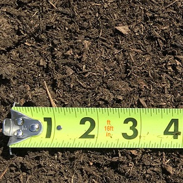
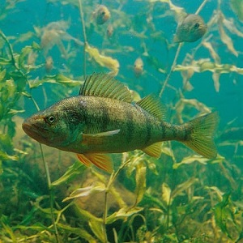
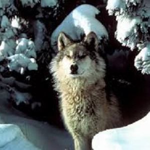

```{r echo=FALSE, eval=FALSE}
# Renders an appropriate HTML file for the webpage
setwd("C:/aaaWork/Web/GitHub/NCMTH107/modules/")
source("../rhelpers/rhelpers.R")
modHTML("BEDAQuant_RevEx_EDA")
```

```{r echo=FALSE, results='hide', message=FALSE}
library(NCStats)
source("../rhelpers/knitr_setup.R")
```

----

&nbsp;

1. [Metals in Topsoil](#metals-in-topsoil)
1. [Highway and City MPG](#highway-and-city-mpg)
1. [Red-Imported Fire Ants and Deer](#red-imported-fire-ants-and-deer)
1. [Yellow Perch Length-Weight](#yellow-perch-length-weight)
1. [Crickets and Temperature](#crickets-and-temperature)
1. [Wolves and Whitetail Deer](#wolves-and-whitetail-deer)

&nbsp;

&nbsp;

----

## Metals in Topsoil


The concentration of cadmium and copper in the topsoil of 115 15mX15m plots along the river Meuse in the village Stein in New Zealand was recorded by van Rijn and Rikken. Use the scatterplot below to describe the bivariate relationship between these two variables.

```{r ScatSoil, echo=FALSE}
par(mar=c(3,3,0.5,0.5),mgp=c(1.9,0.4,0),tcl=-0.2)
data(meuse,package="sp")
plot(copper~cadmium,data=meuse,xlab="Cadmium (ppm)",ylab="Copper (ppm)",
     pch=21,bg="gray80")
legend("topleft",legend=paste("r =",round(cor(meuse$copper,meuse$cadmium),3)),
       bty="n",cex=1.25)
```

[See answer here](zRevExAns/BEDAQuant.html#metals-in-topsoil)

----

## Highway and City MPG


Researchers at Chevrolet attempted to determine the relationship between gas mileage (MPG) of Luminas in the city (CITY) and on the highway (HIGHWAY). Their results are shown below. Use this information to write a brief description of this bivariate relationship.

```{r ScatLumina, echo=FALSE}
lum <- data.frame(HMPG=c(30,29,29,29,28,28,27,27,27,26,26,26,26,26,25,25,25,24,24,24,24,23,23,23,22,22,22,22,21,21,21,20,20,20),
                  CMPG=c(26,26,25,22,23,25,24,23,21,23,22,21,20,19,19,20,21,22,21,19,17,18,19,20,19,18,17,16,17,18,19,18,17,16))
par(mar=c(3,3,0.5,0.5),mgp=c(1.9,0.4,0),tcl=-0.2)
plot(CMPG~HMPG,data=lum,pch=21,bg="gray70",xlab="Highway MPG",ylab="City MPG")
legend("topleft",legend=paste("r =",round(cor(lum$CMPG,lum$HMPG),3)),
       bty="n",cex=1.25)
```

[See answer here](zRevExAns/BEDAQuant.html#highway-and-city-mpg)

----

## Red-Imported Fire Ants and Deer


[Allen *et al.* (1997)](http://digitalcommons.unl.edu/cgi/viewcontent.cgi?article=1047&context=ncfwrustaff) investigated the impact of the density of Red-Imported Fire Ants (*Solenopsis invicta*) on the recruitment of Whitetailed Deer (*Odocoileus virginianus*) fawns (an index of does to fawns). A modified version of their data is recorded in [RIFA.csv](https://raw.githubusercontent.com/droglenc/NCData/master/RIFA.csv). Use this information to write a brief description of this bivariate relationship.

[See answer here](zRevExAns/BEDAQuant.html#red-imported-fire-ants-and-deer)

----

## Yellow Perch Length-Weight


The Park Management team of Kejimkujik National Park, Nova Scotia examined the relationship between the length and weight of Yellow Perch (*Perca flavescens*) captured form Grafton Lake in the park in 2000 following the removal of a dam (Brylinsky 2001). Their data is stored in [PerchGL.csv](https://raw.githubusercontent.com/droglenc/NCData/master/PerchGL.csv). Load these data into R, isolate just the results from 2000 (i.e., use `filterD()`), and generate results to describe this bivariate relationship.

[See answer here](zRevExAns/BEDAQuant.html#yellow-perch-length-weight)

----

## Crickets and Temperature


It has been said that you can roughly estimate the temperature from the number of cricket chirps heard. To determine if this relationship existed, an entomologist recorded the number of chirps in a 15-second interval by crickets held at different temperatures. The researcher's data is recorded in [Chirps.csv](https://raw.githubusercontent.com/droglenc/NCData/master/Chirps.csv). Load these data into R and generate results to write a brief description of this bivariate relationship.

[See answer here](zRevExAns/BEDAQuant.html#crickets-and-temperature)

----

## Wolves and Whitetail Deer


[Mladenoff *et al.* (1997)](https://www.researchgate.net/profile/David_Mladenoff/publication/247843996_Causes_and_Implications_of_Species_Restoration_in_Altered_Ecosystems/links/5410594a0cf2f2b29a40f2ce.pdf) estimated the territory size (km$^{2}$) of Wolf (*Canis lupus*) packs and the density of Whitetail Deer (number/km$^{2}$; *Odocoileus virginianus*) in the same areas in northern Wisconsin. Their data is recorded in [Wolves2.csv](https://raw.githubusercontent.com/droglenc/NCData/master/Wolves2.csv). Load these data into R and generate results to write a brief description of this bivariate relationship.

[See answer here](zRevExAns/BEDAQuant.html#wolves-and-whitetail-deer)

----

