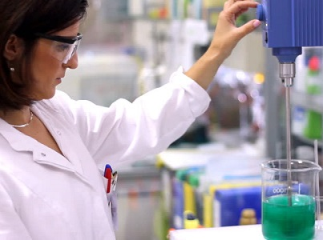

----

&nbsp;

1. Experimental Design
    1. [Elephant Seals](#elephant-seals)
    1. [Sugar Beets](#sugar-beets)
    1. [Translocating Rabbits](#translocating-rabbits)
    1. [Eating Habits of Deer](#eating-habits-of-deer)
    1. [Chemistry Reaction](#chemistry-reaction)
    1. [Diet, Exercise, Blood Pressure](#diet-exercise-blood-pressure)
1. [Observational Studies](#observational-studies)

&nbsp;

&nbsp;

----

## Elephant Seals

While studying the foraging ecology of northern elephant seals (*Mirounga angustirostris*), marine biologists from California observed the health of wild seals in fenced enclosures of two different water temperatures (<47F and >47F) and compared these results to the health of domestic seals in two pools, with water temperatures analogous to the wild seals.  The wild seals were allowed to eat what they wanted, but the domestic seals were fed a known diet.  There were 20 wild seals and 20 domestic seals, each of which was randomly allocated to the two water temperatures (enclosures for the wild seals).  Use this information to answer the questions below.

1. What is the response variable?
1. What are the factors (list all of them)?
1. How many levels are there (list in same order as factors in answer 2)?
1. How many treatments are there?
1. How many replicates are there?
1. Physically, what is a replicate in this experiment (i.e., not a number)?
1. Describe how you would allocate individuals to treatments.  Show your R work.

[See answer here](zRevExAns/DataProduction#elephant-seals)

----

## Sugar Beets

An agronomist is interested in the effect of plowing depth (10 cm, 17 cm, and 25 cm) and amount of applied fertilizer (none or 3 kg per acre) on the harvest of sugar beets. There are 36 nearly identical plots (fields) available for research.  The agronomist has asked you to help design an experiment.  Specifically, you are asked the questions below.

1. What are the factors (list all of them)?
1. How many levels are there (list in same order as factors in answer a)?
1. How many treatments?
1. How many replicates for each treatment?
1. Physically, what is a replicate (i.e., not a number)?
1. What is the response variable?
1. Describe how you would allocate individuals to treatments.  Show your R work.

[See answer here](zRevExAns/DataProduction#sugar-beets)

----

## Translocating Rabbits

Translocation is an important tool in modern wildlife management. Current techniques, however, result in the death of many translocated individuals shortly after release in their new homes. Researchers in France (Letty *et al.* 2000) simultaneously examined the use of tranquilization (tranquilized or not) and acclimatization pens (pens where an individual can "get used to" the new environment; used acclimatization pen or not) on the survival rate (survived or not) of translocated rabbits. Their experiment used a total of 64 European wild rabbits. Use this information to answer the questions below.

1. What is the response variable?
1. What are the factors (list all of them)?
1. How many levels are there (list in same order as factors in answer c)?
1. How many treatments are there?
1. Physically, what is a replicate (i.e., not a number)?
1. How many replicates are there?
1. Describe how you would allocate individuals to treatments.  Show your R work.

[See answer here](zRevExAns/DataProduction#translocating-rabbits)

----

## Eating Habits of Deer

In 1994, biologists studied the health of whitetail deer (*Odocoileus virginianus*) as it relates to eating habits. Sixty-four deer were randomly allocated into four groups. One group was to be kept on a deer farm and fed a strict diet. The other three groups would be sent to Channel Island off the coast of Alaska. One of the Channel Island groups would be restricted to browsing in prairies to simulate farm fields. The second was to be restricted to browsing in hardwood forests. The third Channel Island group would be fed a strict diet on the island. The researchers literally followed these deer around for 9 months, recording what the deer ate as they moved. Urine was also collected to assess the health of the deer. Use this information to answer the questions below.

1. What is the response variable?
1. What are the factors (list all of them)?
1. How many levels are there (list in same order as factors in answer b)?
1. How many treatments are there?
1. How many replicates are there?
1. What is an individual in this experiment?
1. Describe how you would allocate individuals to treatments.  Show your R work.

[See answer here](zRevExAns/DataProduction#eating-habits-of-deer)

----

## Chemistry Reaction

A chemical engineer is designing the production process for a new product. The chemical reaction that produces the product may have higher or lower yield, depending on the temperature and stirring rate in the vessel in which the reaction takes place. The engineer decides to investigate the effect on yield of two temperatures (50C and 60C) and three stirring rates (60, 90, and 120 rpm). A new vessel should be used for each production and only 30 vessels exist. Help the engineer set up this experiment by answering the questions below.

1. What is the response variable?
1. What are the factors (list all of them)?
1. How many levels are there (list in same order as factors in answer a)?
1. How many treatments are there?
1. How many replicates are there?
1. Physically, what is a replicate (i.e., not a number)?
1. Identify the individuals for each treatment.  Show your R work.

[See answer here](zRevExAns/DataProduction#chemistry-reaction)

----

## Diet, Exercise, Blood Pressure

A student is designing an experiment to determine the simultaneous effects of calcium in the diet and regular exercise on blood pressure. In this experiment, some subjects will be given a calcium supplement pill and some will be given a placebo sugar pill. In addition, some subjects will be required to perform aerobic exercises once a day, whereas others will not. The researcher has 32 male subjects available that are as similar as possible (similar ages, weights, initial blood pressures, etc.).  Help the student design this experiment by answering the questions below.

1. What are the factors (list all of them)?
1. How many levels are there (list in same order as factors in answer a)?
1. How many treatments are there?
1. What is the response variable?
1. How many replicates are there?
1. Physically, what is a replicate (i.e., not a number)?
1. Identify the individuals for each treatment.  Show your R work.

[See answer here](zRevExAns/DataProduction#diet-exercise-blood-pressure)

----

&nbsp;

## Observational Studies

You can click on each question to see an answer. Click on it again to close the answer.

  

    

      

        <a data-toggle="collapse" href="#SWIH">The National Institutes of Health (NIH) established the Women's Health Initiative (WHI) in 1991 to address the most common causes of death, disability and impaired quality of life in postmenopausal women. The WHI addressed cardiovascular disease, cancer, and osteoporosis. The WHI was a 15 year multi-million dollar endeavor, and one of the largest U.S. prevention studies of its kind. One aspect of the WHI enlisted 93,676 postmenopausal women between the ages of 50-79 from 40 Clinical Centers from throughout the United States. The women were not asked to take any medication or change their health habits. The health of participants was tracked over an average of eight years by periodically asking the women to complete health forms. What type of study is this?</a>
      

    

    

      
Observational study; a convenience sample in regards to the selection of the clinics and a voluntary response in regards to the subjects.  Overall, I would call it a voluntary response sample as the individuals of the study are the subjects.
      

    

  

  

    

      

        <a data-toggle="collapse" href="#SDOT">The U.S. Department of Transportation sponsored a study to determine the transportation patterns and motivations for driving among offenders before, during, and after suspension of their driver's license for an alcohol-related offense. The travel patterns for each subject were examined for two four-hour periods during the last month of the suspension period (one observation Monday-Thursday 6 - 10 a.m. and the other observation Friday or Saturday evening 6 - 10 p.m.; actual days were randomly selected). These observation periods were selected to include a time period when the subject would likely be traveling to work and a time period when the subject would likely be traveling for personal, recreational, or social reasons. Similar examinations were conducted at least one month after drivers had had their license reinstated. These post-suspension observations were conducted for each subject at the same times of day and days of the week as the during-suspension observations. What type of study is this? [<a href="http://www.nhtsa.dot.gov/people/injury/research/observation_study/index.htm">Here for more information on this topic.</a>]</a>
      

    

    

      
Observational study; a convenience sample in regards to selecting the subjects but a random sample in regards to the times observed.  Overall, I would call this a random sample as the time periods are the individual of interest (although, any inferences will only pertain to the set of subjects observed in this study).
      

    

  

  

    

      

        <a data-toggle="collapse" href="#Pines">I have noticed that the needles of white pine trees near major highways are brown. I hypothesized that this may be caused by increased levels of carbon monoxide (CO; ppm) and salt (ppt) near the roads. I am considering two studies to test this hypothesis. First, at two types of sites -- near highways and far from highways -- I will count the number of trees that are mostly brown and measure levels of CO and salt. Second, I will determine the effect of CO and salt levels by growing 20 randomly-selected nearly-identical seedlings in pots that only differ in the levels of CO and salt -- 0 and 5 ppm CO and 0 and 4 ppt salt. Which study is an observational study? Which study will provide a definitive answer to the stated hypothesis?</a>
      

    

    

      
The first study is the observational study because no conditions are imparted onto the pine trees (in the second study the seedlings are given CO and salt amounts). The experimental (second) study will provide a definitive answer to my hypothesis because it is the only type of study from which ``causal'' statements can be made.  In the experiment, all other variables were controlled for except for the two that I was interested in.  In the observational study, other variables may be responsible for any effect observed.
      

    

  

