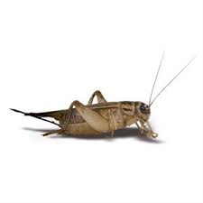

```{r echo=FALSE, eval=FALSE}
# Renders an appropriate HTML file for the webpage
setwd("C:/aaaWork/Web/GitHub/NCMTH107/modules/RE/")
source("../../rhelpers/rhelpers.R")
modHTML("LinearRegression_RevEx")
```

```{r echo=FALSE, results='hide', message=FALSE}
library(NCStats)
source("../../rhelpers/knitr_setup.R")
```

----

&nbsp;

1. Applications Using Summarized Data
    1. [Molting of Wood Thrush](#molting-of-wood-thrush)
    1. [Age and Systolic Blood Pressure](#age-and-systolic-blood-pressure)
    1. [TV Ratings](#tv-ratings)
    1. [Deer Fawns](#deer-fawns)
1. Applications Using R with Raw Data
    1. [Fat Intake and Breast Cancer](#fat-intake-and-breast-cancer)
    1. [Willow Flycatcher Migration](#willow-flycatcher-migration)
    1. [Red-Imported Fire Ants and Deer Fawns](#red-imported-fire-ants-and-deer-fawns)
    1. [Math Assessments](#math-assessments)
    1. [Archiving DNA Tissue](#archiving-dna-tissue)
    1. [Fawn Recruitment and Precipitation](#fawn-recruitment-and-precipitation)
    1. [Cricket Chirps and Temperature](#cricket-chirps-and-temperature)

&nbsp;

&nbsp;

----

## Molting of Wood Thrush


[Vega Rivera *et al.* (1998)](https://sora.unm.edu/sites/default/files/journals/wilson/v110n03/p0384-p0392.pdf) examined the relationship between the duration of molt and the date of molt start (measured in days since July 1) for wood thrush (*Hylocichla mustelina*). A recreation of their results is shown below (note that the outlier marked by a "+"" in the scatterplot was ignored in the calculation of the best-fit line). Use these results to answer the questions below.

```{r FLPThrush, echo=FALSE}
molt <- data.frame(date=c(61,60,58,53,53,51,51,49,48,46,46,47,45,43,43,42,41,41,39,38,37,35,38,35,34,33,34,30,28,30,30,21,24),
                   duration=c(40,42,47,45,48,47,51,49,48,45,51,52,54,54,55,48,50,51,51,52,51,52,55,54,55,55,58,57,55,61,61,59,44))
out <- molt[33,]
molt1 <- molt[-33,]
par(mar=c(3,3,1.5,0.5),mgp=c(1.9,0.4,0),tcl=-0.2)
lm.molt <- lm(duration~date,data=molt1)
fitPlot(lm.molt,pch=21,bg="gray70",
        xlab="Start Date (d since July 1)",ylab="Duration (d))")
points(out$date,out$duration,pch=3)
r2 <- formatC(rSquared(lm.molt),format="f",digits=3)
mtext(bquote(paste(Y==.(formatC(coef(lm.molt)[1],format="f",digits=3))-.(formatC(-1*coef(lm.molt)[2],format="f",digits=3))*X,"    ",r^2==.(r2))),line=0.2,cex=0.8)
```

1. What is the explanatory variable?
1. What is the response variable?
1. In terms of the variables of this problem, what is the equation of the best-fit line?
1. In terms of the variables of this problem, interpret the value of the slope.
1. In terms of the variables of this problem, interpret the value of the intercept.
1. What is the predicted molt duration if the molt starts on September 10 (71 d since July 1)?
1. What is the residual if molt duration is 48 d and the start date is Aug. 12 (43 d since July 1)?
1. What is the correlation between molt duration and molt start date?
1. What proportion of the variability in molt duration is explained when molt start date is 37?
1. What proportion of the variability in molt duration is explained when molt start date is 57?
1. What would happen to the value of the slope if the outlier was NOT ignored?

[See answer here](zRevExAns/LinearRegression.html#molting-of-wood-thrush)

----

## Age and Systolic Blood Pressure


The age (in years) and systolic blood pressure were measured for 32 white males over the age of 40. The researchers wanted to determine if systolic blood pressure increased with increasing age. Thus, they computed the regression depicted in the fitted-line plot below. Use these results to answer the questions below.

```{r FLPAgeSBP, echo=FALSE}
sbp1 <- data.frame(age=c(43,41,43,44,45,46,47,48,49,50,50,49,48,51,53,52,54,54,54,57,56,56,56,58,59,60,62,64,63,65,63,64),
                   sbp=c(120,122,126,144,135,142,129,133,130,132,134,145,160,138,137,149,149,146,141,135,138,142,150,144,166,162,152,152,161,164,170,180))
par(mar=c(3,3,1.5,0.5),mgp=c(1.9,0.4,0),tcl=-0.2)
lm.sbp <- lm(sbp~age,data=sbp1)
fitPlot(lm.sbp,pch=21,bg="gray70",
        xlab="Age (yrs)",ylab="Systolic Blood Pressure")
r2 <- rSquared(lm.sbp)
mtext(bquote(paste(Y==.(formatC(coef(lm.sbp)[1],format="f",digits=3))+.(formatC(coef(lm.sbp)[2],format="f",digits=3))*X,"    ",r^2==.(formatC(r2,format="f",digits=3)))),line=0.2,cex=0.8)
```

1. Which is the explanatory variable?
1. Which is the response variable?
1. In terms of the variables of this problem, what is the equation of the best-fit line?
1. In terms of the variables of this problems, interpret the value of the intercept.
1. In terms of the variables of this problems, interpret the value of the slope.
1. If male A is 3 years younger than male B, how much difference do you expect to see in their systolic blood pressures?
1. What is the predicted systolic blood pressure for a 70-year-old male?
1. What is the residual for a a 50-year-old male with a SBP of 131?
1. What is the correlation coefficient between Age and SBP?
1. What proportion of the variability in SBP is explained by knowing the person's AGE?
1. What is the predicted systolic blood pressure for a 55-year-old male?


[See answer here](zRevExAns/LinearRegression.html#age-and-systolic-blood-pressure)

----

## TV Ratings


There are at least two ways that special TV programs could be rated, and both are of interest to advertisers -- the estimated size of the audience and the percentage of TV-owning households that tuned into the program. Use the results below for the 20 all-time top-rated programs to determine if the estimated size of the audience can be predicted from the percentage of TV-owning households tuned into the program.

```{r FLPTV, echo=FALSE}
tv <- data.frame(rating=c(60.3,53.3,51.1,48.6,46,48.3,48.6,49.1,45.8,46.5,46.5,46,46.3,45.9,47,47.3,47.4,47.7,46.5,45.9),
                 audience=c(50247,41481,36296,45679,44074,41605,40617,40000,40123,39506,38765,38642,35432,32716,35062,34444,33580,33827,27284,25679))
par(mar=c(3,3,1.5,0.5),mgp=c(1.9,0.4,0),tcl=-0.2)
lm.tv <- lm(audience~rating,data=tv)
fitPlot(lm.tv,pch=21,bg="gray70",xlab="Rating (%)",ylab="Audience (1000s)")
r2 <- formatC(rSquared(lm.tv),format="f",digits=3)
mtext(bquote(paste(Y==.(formatC(coef(lm.tv)[1],format="f",digits=3))+.(formatC(coef(lm.tv)[2],format="f",digits=3))*X,"    ",r^2==.(r2))),line=0.2,cex=0.8)
```

1. What did the researchers consider the response variable to be?
1. What is the equation of the best-fit line in terms of the variables of the problem?
1. Interpret the value of the slope in terms of the variables of the problem.
1. What is the predicted audience size for a show with a rating of 40.1%?
1. What is the residual for a show with a rating of 55 and an audience size (1000s) of 40000?
1. What proportion of the variability in audience size is explained by known the rating percentage?
1. What is the correlation between audience size and rating percentage?
1. What are two things that bother you about this analysis as it is presented here? Be specific!

[See answer here](zRevExAns/LinearRegression.html#tv-ratings)

----

## Deer Fawns


Wildlife ecologists in Texas wanted to determine if the number of fawns born to each doe could be explained by the doe's body mass [(Ginnett and Young 2000)](http://www.jstor.org/stable/3802741?seq=1#page_scan_tab_contents). As part of their study, the researchers recorded the mean number of fawns born to a doe (over a period of time) and the body mass of the doe (kg). Use the results in the following graph to explain the relationship to answer the questions below.

```{r FLPFawns, echo=FALSE}
d2 <- data.frame(fawns=c(1.85,1.33,1.61,1.95,2.13,2.53,3.45,2.71,2.53,2.39,2.37,1.82,1.44,1.34,1.48,1.73,1.89,1.93,2.03,2.06,2,1.98,1.96,1.93,1.98,2.07,2.21,2.2,2.24,2.38,2.41,2.55,2.58,3.25,2.87,2.62,2.56,2.42,2.3,2.11,2.14,2.06,1.95,1.67,1.18,1.29,1.06,1.26,1.21,1.5,1.5,1.56,1.61,1.73,1.7,1.8,1.8,1.87,1.9,2.03,2.07,2.09,2.25,2.28,2.31,2.26,2.34,2.38,2.37,2.46,2.53,2.61,2.7,2.71,2.8,2.98,2.95,2.98,2.69,2.66,2.44,2.22,2.12,1.94,1.96,1.83,1.86,1.89,1.92,1.8,1.77,1.85,1.88,1.89,1.94,2.04,1.99,2.06,2.02,1.94,1.89,1.97,1.94,1.75,1.64,1.79,1.51,2.28,2.26,2.18,2.24,2.21,2.18,2.21,2.27,2.36,2.38,2.42,2.46,2.39,2.31,2.42,2.34,2.34,2.41,2.43,2.56,2.68,2.68,2.59,2.56,2.58,2.56,2.68,2.73,2.84,3.04,3.19,2.84,2.8,2.69,2.76,2.91,2.95,3.42,3.03),
                 bodymass=c(21.7,23.4,23.4,22.9,23.4,23.1,24.1,24.5,24.3,24.5,24.5,24.7,25.1,26.3,26.4,25.9,25.2,25.2,25,25.2,25.4,25.4,25.7,25.9,26.1,26,25.4,25.1,25.1,25.1,25,25.2,25.5,26,26.7,26.1,26.8,27,25.9,26.3,26.8,26.9,26.4,27,27.7,27.8,28.9,28.7,30.2,29.7,28.4,27.9,27.5,27.8,28.2,28.4,28.1,27.8,27.4,27.5,27.9,28,27.9,28.1,28.3,27.3,27.6,27.6,28.3,28.3,28,27.3,27.6,27.5,27,27.1,28,28.1,28.3,28.5,28.7,28.4,28.5,28.6,28.8,29.1,29.3,29.3,29.1,29.7,29.9,30,29.8,29.6,29.5,29.9,30.1,30.1,30.5,30.7,30.9,31.3,32.4,32.4,32.5,33.1,34.7,33.6,31.9,31.4,30.9,30.7,29.1,29.1,28.9,29.1,29.1,29,29.3,29.5,30.4,30.4,30.9,31.1,31.1,31.8,31.6,30.9,30.7,30.5,30.2,30.1,29.2,29.2,29.1,29,29,29.1,29.4,29.6,29.8,30,29.7,29.9,30.1,33.6))
par(mar=c(3,3,1.5,0.5),mgp=c(1.9,0.4,0),tcl=-0.2)
lm.d2 <- lm(fawns~bodymass,data=d2)
fitPlot(lm.d2,pch=21,bg="gray70",
        xlab="Doe Body Mass (kg)",ylab="Mean Fawns per Doe",ylim=c(1,4))
r2 <- formatC(rSquared(lm.d2),format="f",digits=3)
mtext(bquote(paste(Y==.(formatC(coef(lm.d2)[1],format="f",digits=3))+.(formatC(coef(lm.d2)[2],format="f",digits=4))*X,"    ",r^2==.(r2))),line=0.2,cex=0.8)
```

1. Which is the explanatory variable?
1. Which is the response variable?
1. Express the equation of the best-fit line in terms of the variables of the problem.
1. Interpret the slope of the best-fit line in terms of the variables of the problem.
1. If a doe weighed 45 kg, how many fawns on average would you expect her to have?
1. If a doe weighing 32 kg gave birth to an average of 1.9 fawns, what is the residual for this doe?
1. What is the correlation coefficient between mean number of fawns born and doe body mass?
1. How much of the variability in the mean number of fawns born is explained by knowing the body mass of does?
1. If body mass increases by 5 kg, how many more fawns can you expect that doe have?
1. Do you have any concerns about the strength of this relationship?

[See answer here](zRevExAns/LinearRegression.html#deer-fawns)

----

## Fat Intake and Breast Cancer


[Carroll (1975)](http://cancerres.aacrjournals.org/content/canres/35/11_Part_2/3374.full.pdf) examined the relationship between per capita consumption of animal fat (g/day; `AnimFatI`) and age-adjusted death rate from breast cancer (`AgeAdjDe`) for 39 countries. Her goal was to determine if variability in the breast cancer death rate could be explained by the amount of fat consumed. The data for their study are found in [CancerFat.csv](https://raw.githubusercontent.com/droglenc/NCData/master/CancerFat.csv). Load these data into R and produce results that can be used to answer the questions below.

1. Which variable is the response variable?
1. What is an individual in this study?
1. In terms of the variables of this problem, what is the equation of the best-fit line?
1. In terms of the variables of this problems, interpret the value of the slope.
1. If country A consumes 4 g/day less animal fat than country B, how much different will the predicted age adjusted death rate due to breast cancer be for country A?
1. What is the predicted age adjusted death rate due to breast cancer for a country that consumes 170 g/day of animal fat?
1. What is the residual for a country that consumes 90 g/d of animal fat and has an age adjusted death rate due to breast cancer of 14.5?
1. What is the correlation coefficient between the age adjusted death rate and the intake of animal fat?
1. How much of the variability in a country’s age adjusted death rate due to breast cancer is explained by knowing the value of its animal fat intake?
1. Can it be said that an increase in intake of animal fat is the cause for an increase in the age adjusted death rate due to breast cancer? Why or why not?

[See answer here](zRevExAns/LinearRegression.html#fat-intake-and-breast-cancer)

----

## Willow Flycatcher Migration


[Yong and Finch (1997)](https://www.fs.fed.us/rmrs/publications/migration-willow-flycatcher-along-middle-rio-grande) hypothesized that larger Willow Flycatchers (*Empidonax traillii*) migrated up the Middle Rio Grande River earlier than small willow flycatchers. To test this hypothesis they captured flycatchers on several days during their migration and measured the wing length (mm; an index of overall body size) of each bird. They recorded the date that the bird was captured as a Julian date (days since Jan. 1).  The results of their study are found in [Flycatcher.csv](https://raw.githubusercontent.com/droglenc/NCData/master/Flycatcher.csv). Load these data into R and produce results that can be used to answer the questions below.

1. What is the explanatory variable?
1. What is the response variable?
1. In terms of the variables of this problem, what is the equation of the best-fit line?
1. In terms of the variables of this problem, interpret the value of the intercept.
1. In terms of the variables of this problem, interpret the value of the slope.
1. How much different do you expect the wing length to be ten days later?
1. What is the predicted wing length on day 180?
1. What is the residual for a bird with wing length 66.5 on day 151?
1. What proportion of the variability in wing length is explained by knowing the date?
1. What is the correlation coefficient between wing length and date?
1. Comment on the assumptions of the linear regression.

[See answer here](zRevExAns/LinearRegression.html#willow-flycatcher-migration)

----

## Red-Imported Fire Ants and Deer Fawns


[Allen *et al.* (1997)](http://digitalcommons.unl.edu/cgi/viewcontent.cgi?article=1047&amp;context=ncfwrustaff) investigated the impact of the density of red-imported fire ants (*Solenopsis invicta*; RIFA) on the recruitment of white-tailed deer (*Odocoileus virginianus*) fawns (an index of does to fawns). A modified version of their results are found in [RIFA.csv](https://raw.githubusercontent.com/droglenc/NCData/master/RIFA.csv). Load these data into R and produce results that can be used to answer the questions below.

1. What is the response variable?
1. What is the explanatory variable?
1. In terms of the variables of this problem, what is the equation of the best-fit line?
1. In terms of the variables of this problem, interpret the value of the slope.
1. If the RIFA index increases by 500, how much different do you expect fawn recruitment to be?
1. What is the predicted fawn recruitment when the RIFA index is 1700?
1. What is the residual when the RIFA index is 2700 and fawn recruitment is 0.3?
1. What is the correlation coefficient between RIFA and fawn recruitment?
1. What proportion of the variability in fawn recruitment is explained by knowing the RIFA index?
1. Comment on the assumptions in this regression.

[See answer here](zRevExAns/LinearRegression.html#red-imported-fire-ants-and-deer-fawns)

----

## Math Assessments


All incoming freshmen are required to take a math assessment test to determine which math classes they should take. Sometimes pre-registering students will register before taking the assessment. To make the best possible course choices for these students, the adviser would like to predict their assessment score (`ASSESS`) based on their math ACT scores (`ACT`). The ACT score and assessment score from 72 freshmen from 2003 are stored in [NCAssess.csv](https://raw.githubusercontent.com/droglenc/NCData/master/NCAssess.csv). Load these data into R and produce results that can be used to answer the questions below.

1. What is the explanatory variable?
1. In terms of ACT and Assessment test scores, what does the value of the slope mean?
1. Mary Lamb had an ACT score of 40. Predict her assessment score.
1. John Tukey had an ACT score of 19. Predict his assessment score.
1. John Tukey actually scored a 15 on his assessment test. Calculate his residual?
1. What proportion of the variability in assessment score is explained by knowing the ACT score?
1. Do you think that these results provide a useful predictor of math assessment scores in cases where those scores are not available but ACT scores are? Explain.
1. What are the two most important assumptions in a regression analysis. Are these violated for this data set?  Why or why not?

[See answer here](zRevExAns/LinearRegression.html#math-assessments)

----

## Archiving DNA Tissue


[Suit and Bauer (1990)](https://oup.silverchair-cdn.com/oup/backfile/Content_public/Journal/ajcp/94/1/10.1093/ajcp/94.1.49/2/ajcpath94-0049.pdf?Expires=1497290123&amp;Signature=d6mTV1kk347TuG~YpH5RH8BhoBxFngQ7HzeoXVSXAMRXS4g8EWV7-IpnWVEDbhSZC1e4pi8tvl2CVtyAcW4fIkf7vWqeN7PdKOeuZaiW9xL6Qn-Vv4ne1aQHfv~~duVdSiNKU6GXRQJJMBp4FAmFyk9mYfZcdj855McVJBcrIOwcVCrrKOqHKwE~5~uEzZTIXmdBNWhuthrFV~kHo~Lu9xvWxngmtw1x8UsCJwGJHQc5NAbK9bZf5~qaGRUliBETjGTyV7CiD2kQ6Ig7FcnCqJmt7YU7MgpTczi9wFd~uez0ko-0Vx1Bdlrf620aIbXOFaZDne2iRfr55bEByROGYQ__&amp;Key-Pair-Id=APKAIUCZBIA4LVPAVW3Q) examined DNA indices obtained from fresh and frozen tissue samples with the goal of determining if fresh values could be predicted from frozen values. The data for their study are found in [DNA.csv](https://raw.githubusercontent.com/droglenc/NCData/master/DNA.csv). Load these data into R and produce results that can be used to answer the questions below. Note that one outlier should be excluded from the analysis.

1. What did the researchers consider as the response variable?
1. What is the equation of the best-fit line in terms of the variables of the problem?
1. Interpret the value of the slope in terms of the variables of the problem.
1. What is the predicted fresh index if the frozen index is 4.05?
1. What is the residual for a fresh index of 2.1 and a frozen index of 2.2?
1. What proportion of the variability in the fresh index is explained by knowing the frozen index?
1. What is the correlation between the fresh and frozen indices?
1. What are the two major assumptions of regression and do they look like they’ve been met with these data (be specific!)?

[See answer here](zRevExAns/LinearRegression.html#archiving-dna-tissue)

----

## Fawn Recruitment and Precipitation


Wildlife ecologist in Texas wanted to determine if the amount of precipitation could explain some of the variability observed in the number of fawns born to each doe [(Ginnett and Young 2000)](http://www.jstor.org/stable/3802741?seq=1#page_scan_tab_contents). Because Texas has many different climatic regions, the state was broken down into eight precipitation zones, and the mean precipitation for each zone over a period of five years was calculated. Furthermore, the researchers measured the mean number of fawns born per 100 does for each of these five years. The data for their study are found in [Deer1.csv](https://raw.githubusercontent.com/droglenc/NCData/master/Deer1.csv). Load these data into R and produce results that can be used to answer the questions below.

1. Express the equation of the best-fit line in terms of the variables of the problem.
1. Interpret the slope of the best-fit line in terms of the variables.
1. If the mean precipitation in an area were 1500 mm, how many fawns per 100 does would you expect?
1. If a precipitation zone has a mean precipitation of 1050 mm and an average of 37 fawns per 100 does, what is the residual of this zone?
1. What is the correlation coefficient between mean no. of fawns per 100 does and mean precipitation?
1. What proportion of the variability in the mean number of fawns per 100 does is explained by knowing the mean precipitation?
1. If the average amount of precipitation increases by 100 mm, how many more fawns per 100 does would you expect to be born?

[See answer here](zRevExAns/LinearRegression.html#fawn-recruitment-and-precipitation)

----

## Cricket Chirps and Temperature


It has been said that temperature can be estimated from the number of cricket chirps heard. To determine if this relationship existed, an entomologist recorded the number of chirps in a 15-second interval by crickets held at different temperatures. The data for their study are found in [Chirps.csv](https://raw.githubusercontent.com/droglenc/NCData/master/Chirps.csv). Load these data into R and produce results that can be used to answer the questions below.

1. What is the response variable?
1. What is the explanatory variable?
1. In terms of the variables of this problem, what is the equation of the best-fit line?
1. In terms of the variables of this problem, interpret the value of the slope.
1. If the number of chirps increases by 5, then how much different do you expect temperature to be?
1. If you hear 18 chirps during the day and 15 chirps at night, then how much different is the temperature, on average?
1. What is the residual when you hear 12 chirps and the temperature is 65 F?
1. What is the correlation coefficient between temperature and the number of chirps?
1. What proportion of the variability in temperature is explained by knowing the number of chirps?
1. Construct a residual plot and use it to interpret the validity of regression assumptions.

[See answer here](zRevExAns/LinearRegression.html#cricket-chirps-and-temperature)

----
