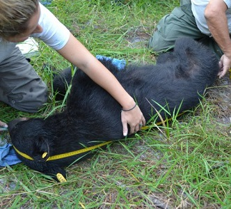
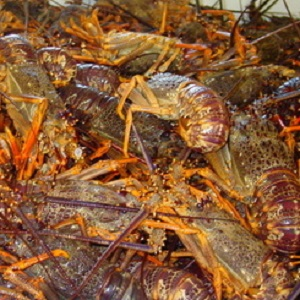

----

&nbsp;

1. Calculations Without a Context
    1. [Situation 1](#situation-1)
    1. [Situation 2](#situation-2)
1. Applications With a Context
    1. [Age of College Graduates](#age-of-college-graduates)
    1. [Black Bear Size](#black-bear-size)
    1. [Shrew Brain Weights](#shrew-brain-weights)
    1. [Bus Arrival Times](#bus-arrival-times)
    1. [Roe Deer Fawns](#roe-deer-fawns)
    1. [Commercial Crayfishing](#commercial-crayfishing)

&nbsp;

&nbsp;

----

## Situation 1

Use R and X~N(0,1) to answer the questions below.

1. What percentage of X<0.11?
1. What percentage of X>-0.11?
1. What percentage of -1.45<X<1.11?
1. What is the X that has 33% of Xs smaller?
1. What is the X that has 25% of Xs larger?
1. What are the most common 90% of Xs?

[See answer here](zRevExAns/NormalDist_Calc.html#situation-1)

----

## Situation 2

Use R and Y~N(70,6) to answer the questions below.

1. What percentage of Y>75?
1. What percentage of Y<63?
1. What percentage of 62.3<Y<72.9?
1. What is Y such that 30% of Ys are smaller?
1. What is Y such that 40% of Ys are larger?
1. What are the most common 50% of Ys?

[See answer here](zRevExAns/NormalDist_Calc.html#situation-2)

&nbsp;

----

## Age of College Graduates

The age at which "traditional" students graduate from college is N(22.1, 1.1). Use this information to answer the questions below.

1. What percentage of the students graduate by the age of 21?
1. What percentage of the students graduate after age 24?
1. What is the age range for the middle 95% of the students?
1. What is the age at which 90% of the students have graduated?

[See answer here](zRevExAns/NormalDist_Calc.html#age-of-college-graduates)

----

## Black Bear Size

We know, from years of study of Black Bears, that the population distributions for head length is N(13.7,1.9), neck girth is N(20.9,4.8), and body length is N(60.0,10). All other variables measured on Black Bears cannot be described by a normal distribution. Use this information to answer the questions below. 
1. What is the percentage of bears between 45" and 65" in body length?
1. What is the neck girth such that 20% of the bears have a larger girth?
1. What is the most common 50% of head lengths?
1. What is the percentage of bears that weighs more than 200 lbs?

[See answer here](zRevExAns/NormalDist_Calc.html#black-bear-size)

----

## Shrew Brain Weights

The brain weights of short-tailed shrews (*Blarina brevicauda*) is normally distributed with a mean of 0.14 grams and a standard deviation of 0.04 grams. Use this information to answer the questions below.

1. What percentage of shrews have a brain weight less than 0.09 grams?
1. What percentage of shrews have a brain weight between 0.09 and 0.17 grams?
1. What is the brain weight such that 30% of all shrews have a larger brain weight?

[See answer here](zRevExAns/NormalDist_Calc.html#shrew-brain-weights)

----

## Bus Arrival Times

The distribution of arrival times for the BART bus at Northland is normally distributed with a mean of 0 and standard deviation of 3, where negative values indicate early arrivals (i.e., before the scheduled time) and positive values indicate late arrivals. Use this information to answer the questions below.

1. What percentage of the arrivals are more than 5 minutes late?
1. What percentage of the arrivals are more than 4 minutes early?
1. What percentage of the arrivals are between 4 minutes early and 4 minutes late?
1. What is the arrival time such that 25% of all arrival times are later than that time?
1. What are the most common 60% of arrival times?
1. What kind of variable is arrival time?

[See answer here](zRevExAns/NormalDist_Calc.html#bus-arrival-times)

----

## Roe Deer Fawns

Researchers on Storfosna Is., Norway wanted to examine reproductive habits of roe deer *Capreolus capreolus* in the northern extremities (Andersen and Linnell 2000). The researchers observed how many fawns were born to each of 149 female, sexually mature roe deer between the years 1991 and 1994. The mean number of fawns from each deer was 2.235 with a standard deviation of 0.460. Use this information to answer the questions below.

1. What percentage of does have less than 2 fawns.
1. What percentage of does have more than 3 fawns.
1. What percentage of does have between 1 and 3 fawns.
1. What is the number of fawns such that only 7.6% of the does have fewer fawns?
1. What is the number of fawns such that only 4.2% of the does have more fawns?
1. What is the most common 87% of number of fawns born per doe?

[See answer here](zRevExAns/NormalDist_Calc.html#roe-deer-fawns)

----

## Commercial Crayfishing

I recently investigated the efficacy of becoming a commercial crayfisherman (crayfish = crawfish = crawdad) on the lake I live on. With carefully constructed samples I concluded that the size of crayfish was N(93,8). The market for crayfish resides in Sweden. Swedes prefer (hence, will only buy) crayfish that are between 90 and 110 mm long (<90 are too small to deal with and >110 taste bad). Use this information to answer the questions below.

1. How many acceptably-sized crayfish could I send to market, if I could catch approximately 50,000 crayfish? [HINT: compute the proportion of preferably-sized crayfish first.]
1. If I could find an alternative market for the larger (>110) crayfish, how many could I send to it (again assume that I could catch 50,000 crayfish)?

[See answer here](zRevExAns/NormalDist_Calc.html#commercial-crayfishing)

----

