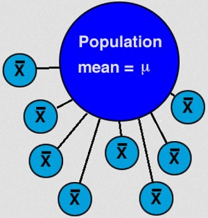

----

<strong>Note:</strong> Your answers to the questions below should follow the <a href="../resources/hwformat" target="_blank">expectations for homework found here</a> (and <a href="../resources/FAQ/FAQs/HWFormat_Example.pdf" target="_blank">demonstrated here</a>). Date due on <a href="../resources/Dates-Current.html" target="_blank">Dates page</a>.

----

## Simulating a Sampling Distribution

Suppose that a population consists of eight individuals with the following "values": 2, 3, 4, 5, 6, 7, 8, and 9. Use this information to answer the questions below.

1. Construct a table of values for all possible samples of n=2. [*Hints: There are 28 such samples. See footnote related to Table 9.1 in the textbook. Just copy the output from R rather than attempting to format the table like that in Table 9.1.*]
1. Construct a table of means for all possible samples of n=2. [*Hint: See footnote related to Table 9.1 in the textbook.*]
1. Describe the general shape of the histogram of the sample means from all 28 samples. [*Hint: See footnote related to Figure 9.1 in the textbook.*]
1. How does the average of the 28 sample means compare to the mean of all eight individuals in the population? What statistical definition does this illustrate about the sample mean as an estimator of the population mean? [*Hint: See Section 4.1.5 for a reminder about how to compute means and standard deviations (next question) in R.*]
1. What is the correct name for the standard deviation of the 28 sample means? How do you expect this value to change if means from samples of n=3 were used instead from n=2?

----

## Precision and Accuracy

Answer the questions below assuming that a population is known to have a mean of 60.

1. Construct a hypothetical series of four numbers (that could represent sample means) that would be considered both precise and accurate.
1. Construct a hypothetical series of four numbers that would be considered imprecise but accurate.
1. Construct a hypothetical series of four numbers that would be considered precise but inaccurate.
1. Construct a hypothetical series of four numbers that would be considered imprecise and inaccurate.

----

## Reproductive Habits of Roe Deer

Researchers on Storfosna Island, Norway examined the reproductive habits of Roe Deer (*Capreolus pygargus*) in the northern extremities of the island ([Andersen and Linnell 2000](https://www.researchgate.net/publication/229194908_Irruptive_Potential_in_Roe_Deer_Density-Dependent_Effects_on_Body_Mass_and_Fertility)). The researchers found that the distribution of number of fawns born to a female between 1991 and 1994 was extremely right-skewed with a mean of 2.2 and a standard deviation of 0.46 fawns. Answer the questions below assuming that these values represent the entire population of Roe Deer. [*Note: if you decide that a question cannot be answered, then describe your reasoning very specifically.*]

1. What is the probability that a Roe Deer has more than 2 fawns?
1. What is the probability that a sample of 10 Roe Deer will have an average of more than 2 fawns?
1. What is the probability that a sample of 35 Roe Deer will have an average of more than 2 fawns?
1. What is the probability that a sample of 35 Roe Deer will have a mean between 2.0 and 2.3 fawns?
1. What is the most common 90% of sample means for n=35 Roe Deer?
1. What is the mean such that 20% of all samples of n=35 Roe Deer have a smaller mean?

----
