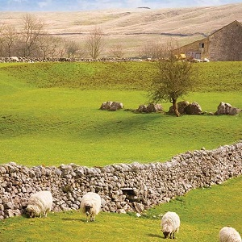

----

## Raccoons Consuming Corn

The WI Department of Natural Resources is examining the amount of domestic corn consumed by raccoons per week. Assume that the amount eaten is slightly right-skewed, with a mean of 8 kg, and a standard deviation of 2 kg.

1. What is the probability that a raccoon consumes more than 13 kg per week?
1. What is the probability that a sample of 25 raccoons have a mean corn consumption of more than 10 kg per week?
1. What is the probability that a sample of 60 raccoons have a TOTAL corn consumption of more than 510 kg per week?

[See answer here](zRevExAns/SamplingDists#raccoons-consuming-corn)

----

## NFL Running Backs

Suppose that it is known that the number of yards gained per game for the primary running  back on a National Football League team is slightly left-skewed with a mean of 82 yards and a standard deviation of 26 yards.

1. What is the probability that a running back will gain more than 100 yards in a single game?
1. What is the probability that a running back will average more than 100 yards per game in a 16-game season?
1. What is the probability that a running back will average between 70 and 90 yards per game in a 16-game season?
1. What is the probability that a running back will average more than 70 yards per game over two 16-game seasons?
1. What is the top 25% of yards gained by a running back in a single game?
1. What is the top 5% of mean yards gained by a running back in a 16-game season?

[See answer here](zRevExAns/SamplingDists#nfl-running-backs)

----

## Stock Returns 

Suppose that the average annual rate of return for a wide array of available stocks is approximately normally distributed with a mean of 4.2 with a standard deviation of 4.9.

1. What is the probability that five randomly selected stocks produce a positive average rate of return?
1. What is the probability that a randomly selected stock produces a positive rate of return?
1. What is the probability that ten randomly selected stocks produce a less than 2% average rate of return?
1. The top 10% of stocks produce what rate of return?
1. The top 10% of random samples of 10 stocks produce what average rate of return?

[See answer here](zRevExAns/SamplingDists#stock-returns)

----

## HMF in Honey

Renner (1970) examined the content of hydroxymethylfurfurol (HMF) in honey. HMF is an organic compound derived from cellulose without the use of fermentation and is a potential "carbon-neutral" source for fuels. This study found that the distribution of HMF in honey was extremely strongly right-skewed with a mean of 9.5 g/kg and a standard deviation of 13.5 g/kg.

1. What is the probability that one kg of honey have more than 20 g of HMF?
1. What is the probability that 20 samples of one kg of honey have an average of more than 20 g of HMF?
1. What is the probability that 50 samples of one kg of honey have an average of less than 10 g of HMF?
1. What are the 20% least common average amounts of HMF in 50 samples of one kg of honey?

[See answer here](zRevExAns/SamplingDists#hmf-in-honey)

----

## Size of Farms in England 

[Allanson (1992)](http://onlinelibrary.wiley.com/doi/10.1111/j.1477-9552.1992.tb00210.x/full) examined the size of farms in England in 1939 and 1989. He found the distribution of farm sizes in 1989 to be very right-skewed with a mean of 65.13 ha and a standard deviation of 108.71 ha.

1. What are the 10% most common sizes of farms in England?
1. What are the 10% most common average sizes in samples of 60 farms from England?
1. What is the probability that the average size of 60 farms from England is less than 50 ha?
1. What is the probability that a farm from England is greater than 50 ha?

[See answer here](zRevExAns/SamplingDists#size-of-farms-in-england)

----

## Painted Turtle Hatchling Size

[Janzen and Morjan (2002)](https://www.researchgate.net/profile/Julian_Faivovich/publication/250071214_The_Identity_of_Hyla_ehrhardti_Muller_1924_Anura_Hylidae/links/00b7d5215272745f66000000.pdf) examined the size of male and female painted turtles (*Chrysemys picta*) at hatching. They found in a sample of 77 turtles that size at hatching was very slightly right-skewed with a mean of 4.46 g with a standard deviation of 0.13 g. Assume that the results of this sample extend to the population to answer the questions below.

1. What is the probability that a turtle will hatch in more than 7 days?
1. What is the probability that a sample of 20 turtles will have an average number of days until hatching that is greater than 4.5 days?
1. What is the probability that a sample of 50 turtles will have an average number of days until hatching that is greater than 4.5 days?
1. What is the mean number of days until hatching such that 20% of samples of 50 turtles have a smaller mean?
1. What are the most common 80% of times to hatching?

[See answer here](zRevExAns/SamplingDists#painted-turtle-hatchling-size)

----

## Moose Hunting 

Assume that it is known that the distribution of time spent hunting (hours) by an individual Minnesota moose (*Alces alces*) hunter is approximately symmetric in shape with a mean of 40 hours and a standard deviation of 15 hours. Use this information to answer the questions below.

1. Describe what an individual is in this problem.
1. List the variable or variables in this problem and identify the type of variable for each.
1. What is the probability that a hunter will spend more than 55 hrs hunting moose?
1. What is the probability that the average hours spent hunting by a sample of 25 hunters is greater than 48 hrs?

[See answer here](zRevExAns/SamplingDists#moose-hunting)

----
