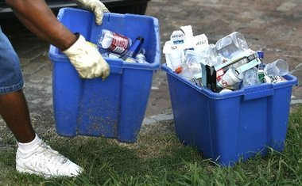

----

## Drinking Water Source


The Environmental Protection Agency (EPA) commissioned the Gallup Organization to conduct a nationwide telephone survey of 1000 households during August and September of 2002 regarding consumer knowledge and satisfaction with drinking water quality. Of the 1000 respondents surveyed, 751 knew that their drinking water came from a public or commercial water supplier. Of these 751 respondents, the following percentages knew precisely where that water was derived:

| Source     | Groundwater | Lake/ Reservoir | River | Multiple Sources | Don't Know | Refused to answer |
|------------|:-----------:|:--------------:|:-----:|:----------------:|:----------:|:-----------------:|
| Percentage |     15.9    |      29.2      |  9.6  |        15.7      |    29.4    |        0.2        |

1. Construct a frequency table of these data (note percentages above were rounded).
1. Write a brief conclusion derived from these data.

[See answer here](zRevExAns/UEDACat.html#drinking-water-source)

----

## Curbside Recycling


A neighborhood in Honolulu conducted a survey to determine if residents participated in the curbside recycling program. One question on their survey was "How much has curbside recycling reduced your regular refuse? 0%, 25%, 50%, 75%, 100%, or 'too early to tell'?" The individual responses for the returned surveys are shown below with letters corresponding to the category choices offered (e.g., "A"=0%, "B"=25%, and so on).

```
C, C, B, B, B, B, C, E, B, B, C, B, C, B, C, C, C, E, B, B, B,
C, B, B, C, C, C, B, C, B, C, B, B, C, B, C, B, B, B, C, E, B,
E, B, B, C, C, B, B, B, E, B, C, C, C, B, B, C, B, B, B, B, B
```

Enter these data into R and construct a univariate EDA.

[See answer here](zRevExAns/UEDACat.html#curbside-recycling)

----

## Water Usage


Students in a senior level environmental studies class at Rice University conducted a voluntary response survey regarding water usage by their peers. They received returned surveys from a total 130 students. One question on their survey was, "On average, for how many minutes do you let the water run each time you take a shower? 0-5, 6-10, 11-15, or over 15 minutes?" The individual responses for this survey are shown below with letters corresponding to the category choices offered (e.g., "A"=0-5, "B"=6-10, and so on).

```
D, C, B, B, C, C, B, B, C, C, C, B, D, B, C, C, B, C, D,
B, C, C, A, B, C, C, A, C, C, D, A, C, C, B, B, B, B, B,
D, B, D, B, C, B, C, C, D, C, B, B, D, C, B, C, B, B, C,
B, C, B, C, B, B, C, D, B, C, D, C, B, C, D, C, C, B, C,
D, B, B, D, B, C, B, B, C, B, C, D, D, C, D, B, B, C,
A, A, B, C, B, C, D, D, C, B, D, C, C, C, C, A, C, D,
B, B, D, C, B, B, A, B, C, B, D, C, C, B, C, C, B, B
```

Enter these data into R and create results to answer the questions below.

1. Construct a frequency table of these data.
1. Construct a percentage table of these data.
1. Write a brief conclusion derived from these data.

[See answer here](zRevExAns/UEDACat.html#water-usage)

----

## Zoo Animal Types


The data in [Zoo1.csv](https://raw.githubusercontent.com/droglenc/NCData/master/Zoo1.csv) contains a list of animals found in several different zoos. In addition, each animal was classified into broad "type" categories ("mammal", "bird", and "amph/rep"). Perform a univariate EDA for the type of animals in the zoos.

[See answer here](zRevExAns/UEDACat.html#zoo-animal-types)

----
