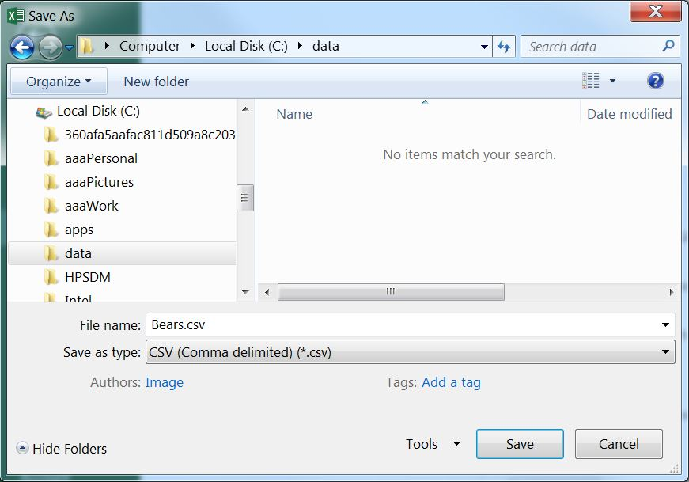
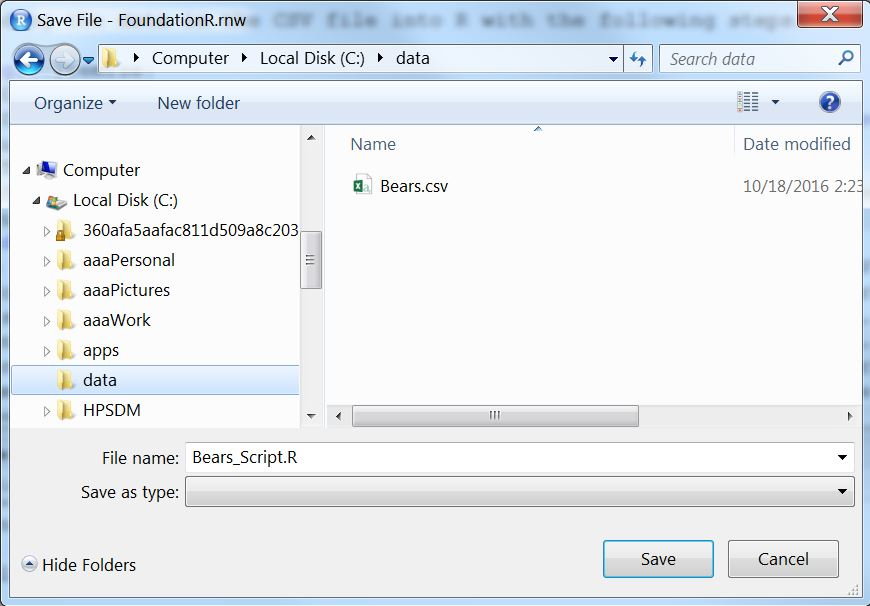
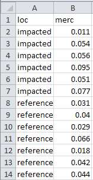

```{r setup, include=FALSE}
knitr::opts_chunk$set(echo=TRUE,fig.align='center',comment="#R>  ")
```

R, RStudio, the `NCStats` package, and very basic usage of R were [introduced here](RStart.html). This module explains how to enter data into R. Subsequent modules will explain how to use R to create the graphics and compute statistics and test results from these data.


&nbsp;

# NCStats Package
`NCStats` is a set of R functions that makes the statistical methods used in this class easier. You should load the `NCStats` package at the beginning of every R script used in this class.

```{r}
library(NCStats)
```


&nbsp;

# Data Types
Data in R will be designated as an `int`eger (whole numbers), `num`eric (non-integer numeric values), `char`acter (strings), `factor` (group membership), or `log`ical (`TRUE`/`FALSE`). Integer and numeric data types correspond to quantitative data. Character and factor data types correspond to categorical data, with the **factor** data type having special characteristics in R that we will exploit for certain analyses. These types of data will be discussed further as need in other modules.


&nbsp;

# Entering Data
For real data (i.e., several variables from many individuals) it is most efficient to enter data into a comma-separated values (CSV) file and then import that file into R. Creating a CSV file with Microsoft Excel is described below, though there are other ways to create CSV files (see [FAQs on class webpage](http://derekogle.com/NCMTH107/resources/FAQ/)). This explanation assumes that you have a basic understanding of Excel (or other spreadsheet software).

The spreadsheet should be organized with variables in columns and individuals in rows, with the exception that the first row should contain variable names. The example spreadsheet below shows the length (cm), weight (kg), and capture location data for a small sample of Black Bears.

<aside>
Variables are in columns.

Individuals are in rows.
</aside>

```{r echo=FALSE, out.width='30%'}
knitr::include_graphics("zimg/Data_File_1.jpg")
```

Variable names must NOT contain spaces. For example, don't use "total length" or "length (cm)". If you feel the need to have longer variable names, then separate the parts with a period (e.g., "length.cm") or an underscore (e.g., "length_cm"). Furthermore, numerical measurements should NOT include units (e.g., don't use "7 cm"). Finally, for categorical data, make sure that all categories are consistent (e.g., do not have a column that contains both "bayfield" and "Bayfield").

The spreadsheet is saved as a CSV file by selecting the **File..Save As** menu item, which will produce the dialog box below. In this dialog box, change "Save as type" to "CSV (Comma delimited) (*.csv)",^[There are several choices for CSV files here; do NOT choose the one with "UTF-8" in the name.], provide a file name (do not put any periods in the name), select a location to save the file (don't forget this location!!), and press "Save". Two "warning" dialog boxes may then appear -- select "OK" for the first and "YES" for the second. You can now close the spreadsheet file.^[You may be asked to save changes -- you should say "No".]

```{r echo=FALSE, out.width='60%'}

```

&nbsp;

The following steps are used to load the data in the CSV file into R.

* Open RStudio.
* Open a new script by selecting the "File", "New File", and "R Script" menu items.
* Type `library(NCStats)` in the new script (i.e., in the upper-left pane).
* Save this script by selecting the "File", "Save" menu items. In the ensuing dialog box, navigate to the **exact same directory** where you saved the data, type a name for the file in the "File name:" box (**do not use a period in this name!!**), and press "Save".

```{r echo=FALSE, out.width='60%'}

```

* Set the working directory (tell R where the file is) with the "Session", "Set Working Directory ...", "To Source File Location" menu items in RStudio. RStudio will print an appropriate `setwd()` command to the console (lower-left pane). Copy this command from the console to the second line in your script.^[Doing this will eliminate the need to manually select the menu options every time you want to run this script.] For example, I stored the file created above in the "C:/data" directory, so that RStudio will create this `setwd("C:/data")`.
* The CSV file is read into R by including the name of the file (in quotes) in `read.csv()`. For example, the external "Bears.csv" file is read into the R object called `bears` with `bears <- read.csv("Bears.csv")`.

```{r echo=FALSE}
bears <- read.csv("data/Bears.csv")
```

* One should check the data in this object as described in the [Viewing a Data Frame] section below.

&nbsp;

It is important that each row of the data frame correspond to one individual. This is critically important when data are recorded for two different groups (e.g., for a two-sample t-test; see [Module 24](Rttests)). For example, the following data are methyl mercury levels recorded in mussels from two locations labeled as "impacted" and "reference."

```
  impacted   0.011  0.054  0.056  0.095  0.051  0.077
  reference  0.031  0.040  0.029  0.066  0.018  0.042  0.044
```

To follow the "one individual per row" rule, these data are entered in **stacked** format where the "reference" data are stacked underneath the "impacted" data and a column is used to indicate to which group the individuals belong. For example, the Excel file for data entry would look like the following.

<aside>
Data should generally be entered in **stacked** format.
</aside>

```{r echo=FALSE, out.width='25%'}

```

### Alternative Forms of Getting Data
Some of the data files that you will use are provided on the [Data for MTH107](http://derekogle.com/NCMTH107/resources/data_107) resource page of the class webpage or linked to from a webpage. In these cases, the data should be downloaded from the webpage and saved in the same directory or folder as your analysis script. The downloaded file is then read into R in the same manner as described previously (i.e., set the working directory with `setwd()` and use `read.csv()`). Note that files provided by me will already be in stacked format.

A few data files used in these notes are supplied with R or the `NCStats` package. These files are loaded with `data()`. For example, the `iris` data file is loaded into R with

```{r}
data(iris)
```


&nbsp;

# Viewing a Data Frame
R may be disorienting at first because you generally cannot "see" your data in the same way that you see it in a spreadsheet program. There are, however, several options for viewing your data. First, you can type the name of the data frame object to see its entire contents.

```{r}
bears
```

Typing the name is adequate for small data.frames, but not useful for large data.frames. The entire data.frame is opened in a separate window by double-clicking on the name of the data.frame in the "Environment" tab of RStudio (in upper-right pane). Alternatively, you can view a subset of 20 rows of a data frame with `peek()`, the first six rows with `head()`, the last six rows with `tail()`, or the first and last three rows with `headtail()`.

<aside>
Use `peek()` or `headtail()` from `NCStats` to view a few rows of a data frame.
</aside>

```{r}
peek(bears)
head(bears)
tail(bears)
headtail(bears)
```

In addition to viewing the contents, it is useful to examine the structure of the data frame as returned from `str()`.

<aside>
Use `str()` to examine the structure of the data frame.
</aside>

```{r}
str(bears)
```

In this example, it is seen that `r kCounts(ncol(bears))` variables were recorded on `r nrow(bears)` individuals. The first two variables -- `r names(bears)[1]` and `r names(bears)[2]` -- are numerical measurements made on the bears. The last variable -- `r names(bears)[3]` -- is a character variable that records the capture location for each bear. The unique values in a character variable may be seen with `unique()`.

```{r}
unique(bears$loc)
```

A character variable may be converted to a factor variable with `factor()`. In this course, the main reason for doing this would be to control the levels of an ordinal variable because R treats levels alphabetically by default. For example suppose that we wanted to order the levels of the `r names(bears)[3]` variable from west to east (so, Douglas, Bayfield, and Ashland). For this purpose the variable is converted to a factor below with `factor()` and the order of the levels is controlled with `levels=`.

<aside>
Make sure the levels are spelled EXACTLY as they appear in the data.
</aside>

```{r}
bears$loc <- factor(bears$loc,levels=c("Douglas","Bayfield","Ashland"))
levels(bears$loc)
```

The levels of a factor variable and their order may be seen with `levels()`.

```{r}
levels(bears$loc)
```

In the previous examples, the `$` notation was used to identify a particular variable (i.e., `loc`) within a data.frame (`bears`). Think of variables as being nested inside data.frames and, thus, to access the variable you must first identify the data.frame in which it exists and then the name of the variable. The `$` simply separates the data.frame from the variable.

<aside>
`$` separates a data frame name and a variable name.
</aside>

```{r}
bears$length.cm
bears$loc
```

&nbsp;

# Vectors
Data.frames are the primary structure in which to store real data. However, much simpler situations that don't require a data.frame may arise. In R, items of the same data type (see [Data Types]) are stored in a one-dimensional **vector**. Vectors are usually displayed in one row (with many columns), but they may also be thought of as a single column (with many rows). Items are entered into a vector with `c()`, where the individual arguments are specific numbers, characters, or logical values.^[`c` comes from "concatenate" or "combine."] Items for a vector of characters must be contained within paired quotes.

```{r}
( v <- c(1,2,5) )
( y <- c("Iowa","Minnesota","Wisconsin") )
```

Single variables from a data.frame are vectors.

```{r}
bears$length.cm
```

Vectors that are not extracted from a data.frame will only be used in this course for very simple lists of items, usually as arguments in a function.


# Corrections {.appendix}
If you see any errors (code, typographical, or logical) please bring these to [my attention](mailto:dogle@northland.edu).
