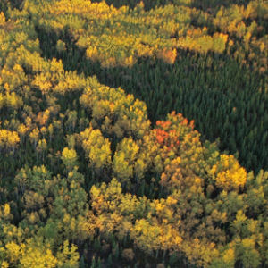

----

For all "hypothesis testing" questions, make sure to provide explicit answers with your work shown for all <a href="../11-steps">11 steps of a hypothesis test</a>.

----

## AIDS Cases

Acquired immunodeficiency syndrome (AIDS) is a specific group of diseases or conditions that indicate severe immunosuppression related to infection with the human immunodeficiency virus (HIV). According to the HIV/AIDS Surveillance Report (11(2)), the number of AIDS cases in the United States for 1999, by gender and race/ethnicity, is shown in the following contingency table. Use this information to determine, at the 1% level, if the distribution of males into the four race/ethnic categories differs from the distribution of females into the four groups.

&nbsp;  | White | Black | Hispanic | other
------- | ----- | ----- | ----- | ----- |
Male    | 12855 | 14946 | 7019 | 439
Female  |  1924 |  6784 | 1948 | 103

----

## Forest Composition

Hely *et al.* (2000; Journal of Vegetation Science 11:813-824) examined the effects of stand composition on fire hazard in mixed-wood Canadian boreal forests.  Two variables that they recorded for each stand were stand type (`sttype`, where `d`=deciduous, `c`=coniferous, `mc`=mixed coniferous, and `md`=mixed deciduous) and the time since the last fire (`tslf`) which was treated as a categorical variable with the categories corresponding to 100 year blocks of time (i.e., `0-100`, `100-200`, etc.).  Use the data in [Fire.csv](https://github.com/droglenc/NCData/raw/master/Fire.csv) to determine, at the 5% level, if the distribution of times since last fire differed by type of forest stand.  Make sure to provide explicit answers with your work shown for all [11 steps of a hypothesis test](../11-steps.html).  [Note: **refactor** `sttype` so that the `c` and `d` levels are ordered at the ends (i.e., so that the categories are arranged from mostly coniferous to mostly deciduous).] [Further Note: please **continue** with all steps even though the assumptions are not met with these data.]

----
