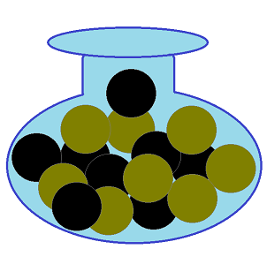
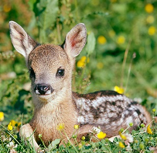

----

<strong>Note:</strong> Your answers to the questions below should follow the <a href="../resources/hwformat" target="_blank">expectations for homework found here</a> (and <a href="../resources/FAQ/FAQs/HWFormat_Example.pdf" target="_blank">demonstrated here</a>). Date due on <a href="../resources/Dates-Current.html" target="_blank">Dates page</a>.

----

## Food Choice by Chipmunks

An "arena" contains 8 acorns and 9 kernels of corn. Assume that a chipmunk placed in the arena chooses items to eat at random. Use this information to answer the questions below.

1. What is the probability that the chipmunk eats an acorn?
1. What is the probability that the chipmunk eats a kernel of corn?
1. What is the probability that the chipmunk eats a kernel of corn assuming that it has already eaten six kernels of corn and no acorns?

----

## Reproductive Habits of Roe Deer

Researchers on Storfosna Island, Norway examined the reproductive habits of Roe Deer (*Capreolus pygargus*) in the northern extremities of the island ([Andersen and Linnell 2000](https://www.researchgate.net/publication/229194908_Irruptive_Potential_in_Roe_Deer_Density-Dependent_Effects_on_Body_Mass_and_Fertility)). The researchers found that the distribution of number of fawns born to a female between 1991 and 1994 was extremely right-skewed with a mean of 2.2 and a standard deviation of 0.46 fawns. Answer the questions below assuming that these values represent the entire population of Roe Deer. [*Note: if you decide that a question cannot be answered, then describe your reasoning very specifically.*]

1. What is the probability that a Roe Deer has more than 2 fawns?
1. What is the probability that a sample of 10 Roe Deer will have an average of more than 2 fawns?
1. What is the probability that a sample of 35 Roe Deer will have an average of more than 2 fawns?
1. What is the probability that a sample of 35 Roe Deer will have a mean between 2.0 and 2.3 fawns?
1. What is the most common 90% of sample means for n=35 Roe Deer?
1. What is the mean such that 20% of all samples of n=35 Roe Deer have a smaller mean?

----

