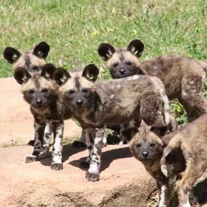

```{r echo=FALSE, eval=FALSE}
# Renders an appropriate HTML file for the webpage
setwd("C:/aaaWork/Web/GitHub/NCMTH107/modules/CE")
source("../../rhelpers/rhelpers.R")
modHTML("UEDAQuant1_CE2")
```

```{r echo=FALSE, results='hide', message=FALSE}
library(NCStats)
source("../../rhelpers/knitr_setup.R")
```

----


## Histograms II

[McNutt and Silk (2007)](https://www.semanticscholar.org/paper/Pup-production%2C-sex-ratios%2C-and-survivorship-in-McNutt-Silk/8bec71d9a4a6ced4896c346dff72df143a10a651) examined pup production, sex ratios and survivorship of African wild dogs (*Lycaon pictus*). In one part of their study, they computed the sex ratio of pups in each litter by dividing the number of males in the litter by the total number of pups in the litter (thus, 1.0 means all males and 0.7 means 70% were males). The results from making this calculations on their sample of litters is shown in the histogram below.

```{r echo=FALSE, fig.width=4, fig.height=4, par1=TRUE}
set.seed(34329034)
df <- data.frame(lsr=rep(seq(0.1,0.91,0.09),c(1,4,19,13,18,16,9,10,3,1))+runif(94,0,0.09))
hist(~lsr,data=df,breaks=seq(0,1,0.1),xaxt="n",ylim=c(0,25),
     xlab="Litter Sex Ratio")
axis(1,seq(0,1,0.1))
abline(h=seq(1,25,1),col="lightgray",lty="dotted")
hist(~lsr,data=df,add=TRUE)
```

Use this histogram to answer these questions.

1. What is an individual in this example?
1. What is the variable in this example?
1. What type of variable is recorded?
1. How many individuals are represented in this histogram?
1. How many litters had a litter sex ratio between 0.6 and 1.0?
1. How many litters had a litter sex ratio between 0.0 and 0.1?
1. Which litter sex ratios range had the most litters observed?
1. Did most litters (the majority) have mostly male or mostly female pups?

----

## Math Class Grades

The University of North Carolina math department is noted for “giving out” low grades. To examine this, the GPA from a random sample of 22 math classes and 29 “other” university classes (from the last year) was collected and recorded in [UNCGrades.csv](https://raw.githubusercontent.com/droglenc/NCData/master/UNCgrades.csv). Use R to answer the following questions for these data.

1. Construct a histogram of `gpa`.
1. Compute summary statistics for `gpa`.
1. Construct histograms of `gpa` for each type of class.
1. Compute summary statistics of `gpa` for each type of class.

----

## Hand Calculations II

1. Hand calculate the mean and standard deviation for six numbers that you make up.
1. Hand calculate the mean and standard deviation for seven numbers that you make up.
1. Hand calculate the median and IQR for 14 numbers that you make up.
1. Hand calculate the median and IQR for 16 numbers that you make up.

See this [hint](UEDAQuant1_CE1.html#hints) for how to check your answers with R.

----
