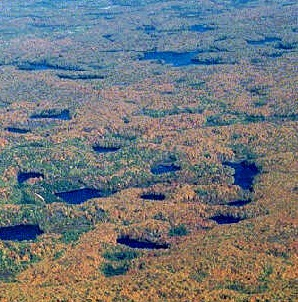

```{r echo=FALSE, eval=FALSE}
# Renders an appropriate HTML file for the webpage
setwd("C:/aaaWork/Web/GitHub/NCMTH107/modules/CE")
source("../../rhelpers/rhelpers.R")
modHTML("WhyStats_CE2")
```

```{r echo=FALSE, results='hide', message=FALSE}
library(NCStats)
source("../../rhelpers/knitr_setup.R")
```

----

## Wisconsin Lakes


There are `r formatC(nrow(ABDLakes),format="f",digits=0)` lakes in Ashland, Bayfield, and Douglas counties of Wisconsin. However, only `r formatC(nrow(filterD(ABDLakes,named)),format="f",digits=0)` of these are named. A random sample of named lakes from this population is extracted with the following R code:

```{r eval=FALSE, prompt=FALSE}
library(NCStats)
named <- filterD(ABDLakes,named)
srsdf(named,n=50,vars=c("county","area"))
```

Use this code and some hand (or calculator) calculations to answer the questions below.

1. Extract a sample of n=50 lakes with the (last line of) code above. Compare the sizes (area in acres) of the first three lakes. This is an example of what type of variability?
1. Compute the proportion of lakes in your sample that are from Bayfield County.
1. Extract another sample of n=50 lakes and compute the proportion of lakes that are from Bayfield County? Compare your two proportions. This is an example of what type of variability?
1. Of the 605 named lakes in the three counties, `r formatC(xtabs(~county,data=filterD(ABDLakes,named))[2],format="f",digits=0)` are from Bayfield County. Was the proportion of named lakes from Bayfield County in either of your samples equal to the proportion of all named lakes that were from Bayfield County?  Were you surprised?  Why or why not?

----

## Frog Survey

Biologists at the Sigurd Olson Environmental Institute (SOEI) were interested in estimating the total number of frogs on all (*many thousands*) lakes in northern Wisconsin (defined as north of Highway 8) in 2010. Towards this end, they used two methods to estimate the number of frogs on each of several randomly selected lakes in northern Wisconsin. The two methods they used were to count the number of frogs seen as they walked the shoreline of the lake (called a *visual* count) and to count the number of individual mating calls heard (called a *call* count). Here, we will only use **visual** count data.

1. What is one of the individuals sampled in this scenario? [*Hint: Think about what the variable is and make sure that it makes sense to record that variable about your individual. You may want to look at the [Foundational Definitions](http://derekogle.com/NCMTH107/modules/FoundationalDefns) module for a definition of "individual".*]
1. Do you think it is reasonable to count the number of frogs on every lake in northern Wisconsin at the same time (say, in the same week)? Why or why not?
1. Hypothetical visual and call counts for every lake in northern Wisconsin (i.e., the population) are recorded in the *Frogs* data.frame. The visual and call counts for a random sample of 10 lakes may be taken from this population by running `srsdf(Frogs,n=10)` in RStudio (make sure you have run `library(NCStats)` first). Paste the output returned from this function into your report document.
1. How do the **visual** counts of frogs recorded from the first three lakes in your sample compare? What type of variability is evident with this comparison?
1. Compute the average **visual** count of frogs in all lakes in your sample. Show your work! [*You may leave space in your document and hand write your work before handing it in*]
1. Extract another sample of 10 lakes (run `srsdf(Frogs,n=10)` again). Paste the results into your report document.
1. Compute the average **visual** count of frogs in all lakes in your second sample. Show your work!
1. How do the average **visual** count of frogs in your two samples compare? What type of variability is evident from this comparison?
1. Suppose that the average **visual** counts of frogs on all lakes in northern Wisconsin (the population) is 225. Was the average visual counts from both of your samples equal to this population value? Why or why not?

----
