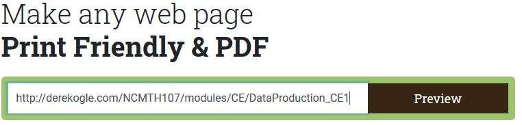
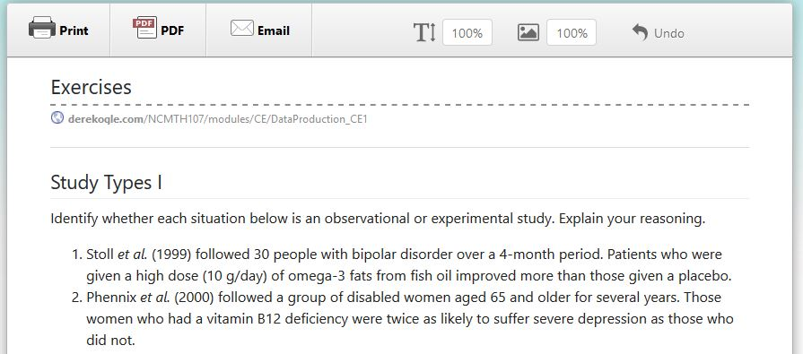

----

All materials for this course on the class webpage and, thus, you may spend a good deal of time reading and watching materials on the computer. You may find yourself wanting to print the materials for access off the computer. This FAQ provides suggestions for one way to easily print the webpages.

* Copy the URL (webpage address) from the address bar at the top of your browser.
* Got to [https://www.printfriendly.com/](https://www.printfriendly.com/).
* Paste the URL in the box under "Make any web page Print Friendly & PDF" (like below).

* Press the Preview button.
* A separate window will appear with a printer friendly version of the webpage (like below).

* You may edit this document by clicking on a line or paragraph and selecting the trash can that will appear. You may delete images by clicking on the image. You may also save paper by selecting a smaller font in the font size box at the top of the new window.
* Once you are happy with the document you may print it by selecting the printer icon or save it to a PDF by seclecting the PDF icon at the top of the new window.
* Once you have printed or saved, then click the back button on your browser to return to the
[https://www.printfriendly.com/](https://www.printfriendly.com/) main page.

Also note the following:

* The [https://www.printfriendly.com/](https://www.printfriendly.com/) page offers an extension for most browsers. You can install this on your personal computers so that you can develop the printer-friendly version of a webpage more quickly.
* All readings on the webpage are already in PDF formats and should be able to be printed easily.

----
