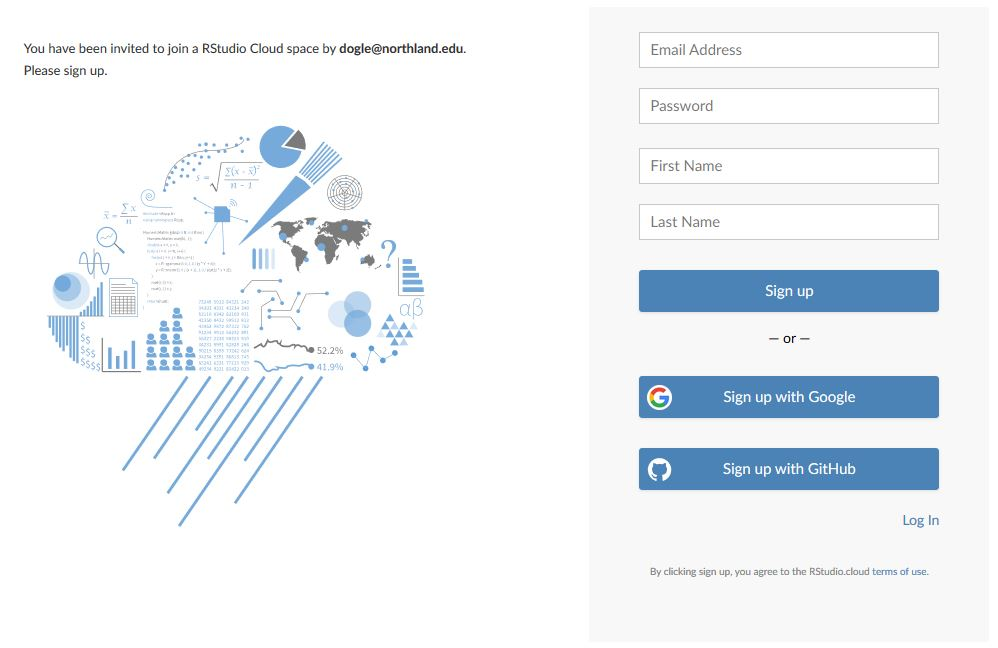
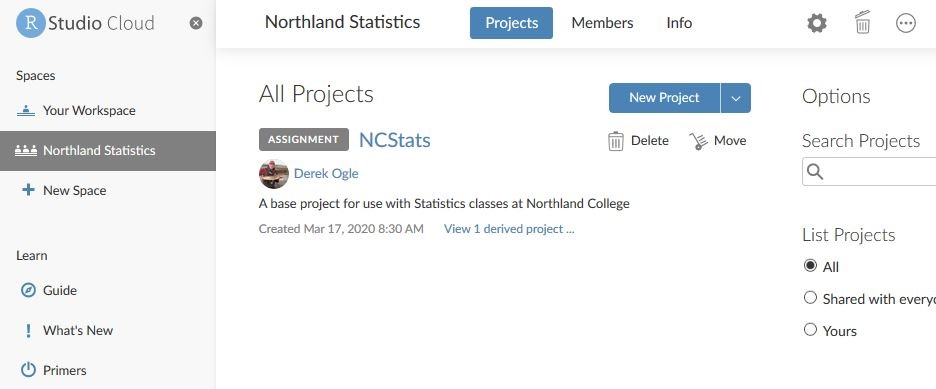
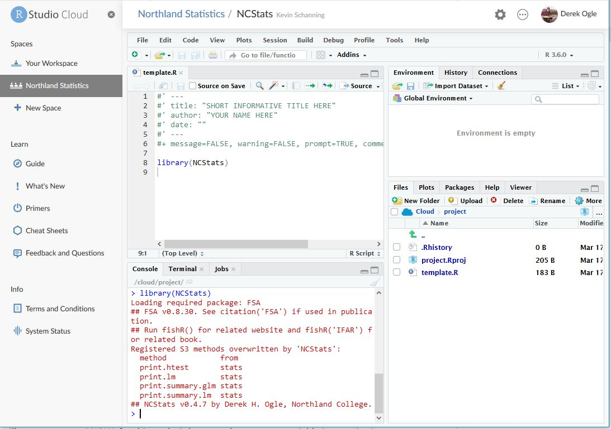
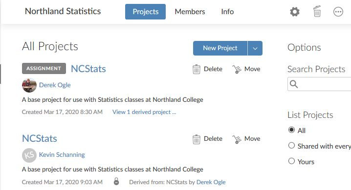

----

Analyses with R and RStudio can be run on through a web browser on "the cloud", thus eliminating the need (and sometimes hassle) to install these softwares and the associated packages on your computer. Follow the directions below if you would like to try using R/RStudio in the cloud.

## Creating an RStudio Cloud Account
You must create a free RStudio Cloud account to use this service. Go to the [RStudio Cloud website](https://rstudio.cloud/) and select "Get Started." In the ensuing dialog box enter your e-mail adddress, a password, and your first and last names. Press "Sign up."

In a subsequent screen you will be asked to provide a name for the account with prompts to use your first and last name. Just press "Create Account" here.

After this you should successfully have an RStudio Cloud account. Now send me (Derek Ogle) a message so that I can invite you to join the "Northland Statistics" space (**I will need to know the e-mail address for your RStudio Cloud account, so include that in the e-mail**).

## Getting Your Own RStudio in the "Northland Statistics" Space
I will send you a link via e-mail that will be an invitation to join the "Northland Statistics" space. Clicking this link will you to a webpage that may look like the sign up from before, but now you can choose the little "Log In" link near the bottom-right (see image above). This should bring you to the "Northland Statistics" space.

In this space you will see a tab called "Projects" with a listing of "All Projects" underneath it. In that list you will see a "START" button next to the word "NCStats" (it will look similar to that below but will have "ASSIGNMENT" replaced with "START").

Click on the "START" button to deploy an RStudio project (this takes a minute or two). Once this project is deployed you will see that it looks like "regular" RStudio. You can start a new script in the usual way or by selecting the "template.R" file from the Files tab in the lower-right pane. The screen below shows the result after opening the template and running `library(NCStats)`.

At this point you can treat this as a regular instance of RStudio. However, loading data is slightly different and is described further below.

To finish up, click on "Northland Statistics" (separated from NCStats by a forward slash) near the top of the page, which will take you back to the "All Projects" view. In this view you should see an "NCStats" with my name next to it and a button that says "CONTINUE." However, you should also see an "NCStats" with your name next to it. I would bookmark/favorite this page and then when you come back simply use the "NCStats" that has your name attached to it.

## Loading Data
Data stored in a CSV must first be uploaded to the "RStudio Cloud" before reading into RStudio with `read.csv()`. To upload a CSV that is on your computer into "RStudio Cloud" select the "Upload" button in the "Files" tab in the lower-right pane of RStudio. Then "Browse ..." to where your file is located and select OK. The CSV file will now appear in the Files pane (see below). This file is then read into "RStudio Cloud" by including the filename in `read.csv()` (note that you do not need to worry about setting the working directory with `setwd()`).

----
