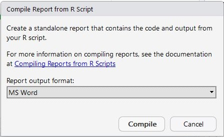

----

In several exercises you will create an script of R commands that will perform certain calculations or produce certain graphs. I will ask that you demonstrate your R code by printing your R script along with the results it produce.

RStudio can compile a script into a report by presssing the "Compile Report button" in the script pane toolbar (see below).


In the ensuing dialog box (below) select "MSWord" to compile the script and results in Microsoft Word.



Unfortunately, this document is a bit "spacious" and thus wastes paper. You can control some of the issues by including the following code at the top of your script (simply copy all lines below into the first eight lines of your script and then change the title and author).

```
#' ---
#' title: "Module X: R Work"   ## Put a good title in the quotes
#' author: "YOUR NAME HERE"
#' date: ""
#' ---
#+ message=FALSE, warning=FALSE, prompt=TRUE, comment="", fig.width=3

library(NCStats)
```

When you compile this report the document should be a little more concise then the default would have been.
