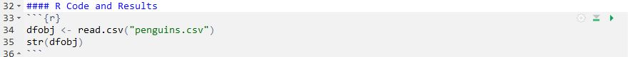
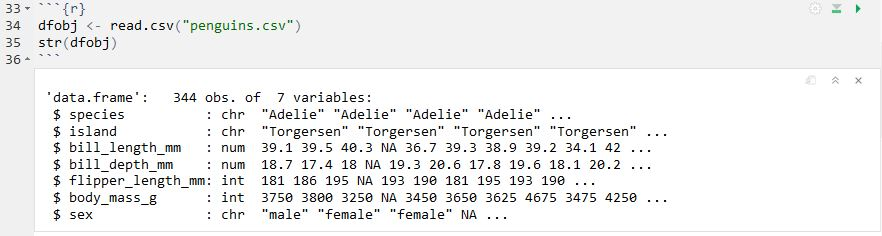
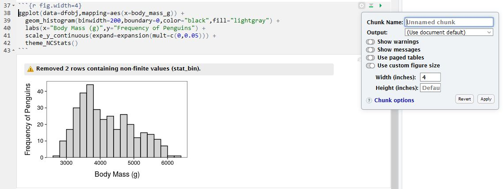
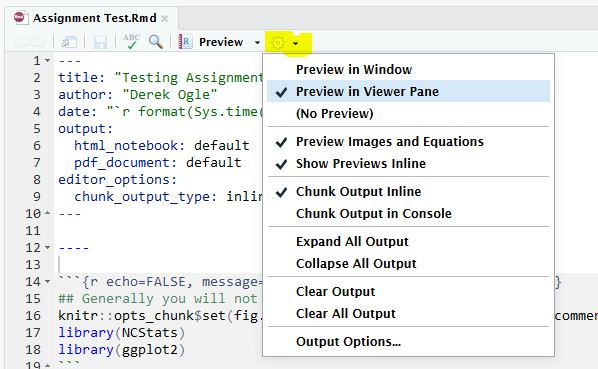
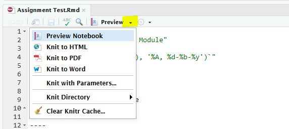
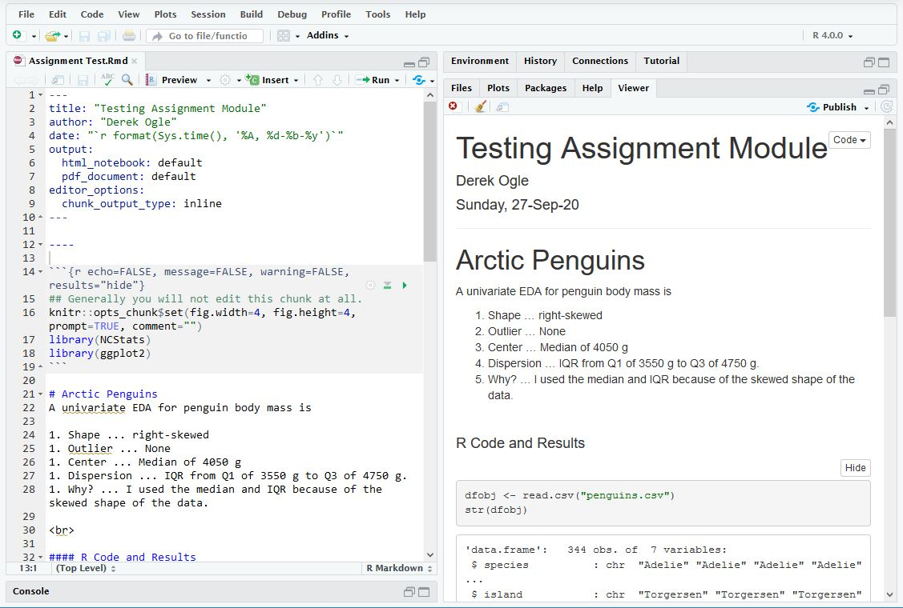
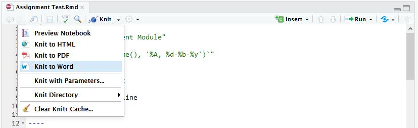
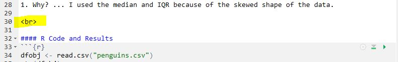

----

# Getting Started
Notebooks in RStudio are an efficient way to enter R code, show results of R code, write answers to assignment questions, and compile all of that to a PDF that can be handed in.

For class assignments, start by copying the following lines exactly to RStudio.

<pre>
---
title: "EDIT TO PUT MODULE NAME HERE"
author: "EDIT TO PUT YOUR NAME HERE"
date: "`r format(Sys.time(), '%A, %d-%b-%y')`"
output:
  pdf_document: default
  html_notebook: default
editor_options:
  chunk_output_type: inline
---

----


```{r echo=FALSE, message=FALSE, warning=FALSE, results="hide"}
## Generally you will not edit this chunk at all.
knitr::opts_chunk$set(fig.width=4, fig.height=4, prompt=TRUE, comment="")
library(NCStats)
library(ggplot2)
```

# EDIT THIS WITH SECTION HEADING TEXT
EDIT THIS WITH TEXT

<br>

### R Code and Results
```{r}
# You will put R code in chunks like this -- CTRL/CMD-ALT-I to add a chunk
```
<pre>

downloading (right-click on) [this template](R Assignment Template.Rmd) and opening it in RStudio. Then immediately save the template file with a different name (e.g., "Assignment1" ... make sure that the name does not have a "dot" in it). Then edit the Title in line 2 to something that represents the assignment (e.g., "Linear Regression in R") and the Author in line 3 to your name. Do not change anything else in the first 20 lines.


<br>

# Including Text in the Notebook
## Creating Sections
Most assignments will have several questions, each of which is identified with a section heading. Your answers to the assignments should be shown under section headings with the same name as on the assignment. Section headings can be created in the notebook by preceding the section heading name with a hashtag. For example, the line below would create a section heading called "Arctic Penguins".

```
# Arctic Penguins
```

## Writing Text for Your Answers
Sentences can be included by simply typing the text at the beginning of any line. A new paragraph is created by pressing return twice so that there is a blank line between paragraphs.

## Numbered Lists for Your Answers
A numbered item list is created by starting a line with "1." followed by what you want after the number (e.g., your answer). If there are no blank lines between consecutive "1." items then RStudio will automatically iterate the numbering when the document is compiled. For example, typing this will produce the result further below ...


A univariate EDA for penguin body mass is

1. Shape ... right-skewed
1. Outlier ... None
1. Center ... Median of 4050 g
1. Dispersion ... IQR from Q1 of 3550 g to Q3 of 4750 g.
1. Why? ... I used the median and IQR because of the skewed shape of the data.

<br>

# Including R Code and Results
My preference is to include a subsection of R code and results **AFTER** you have answered the questions. You can create a subsection for this code by starting a line with "#### R Code and Results".

All R code is entered into a "code chunk." Code chunks begin with three backticks followed by curly brackets around "r" (see line 33 below) and end with three backticks (see line 36 below). Between the beginning and ending of the code chunk can be any viable R code. For example,



In RStudio, each code chunk will have three "icons" in the upper-right portion of the gray chunk (see above). Pressing the right-most icon (right-pointing green arrow) will run the code in the current chunk and show the results immediately below the chunk. For example,



If the code in this chunk depends on code in previous chunks being run then press the middle icon (gray down arrow pointing to a green horizontal line) to run all code in chunks above the current chunk. If the code in previous chunks had already been run then this is unnecessary.

Code chunks can have a variety of settings. The most important settings can be controlled through the left-most "gear" icon. My most common change here is to change the figure width to be smaller (to 4 inches wide) and, if you want the plot to be square, to change the figure height to the same value. I may also "turn off" the warnings and messages, but I never do this immediately as I would like to see those first before deciding that I should "hide" them. Below shows the gear box for changing the figure width and how the code chunk and result is changed.



<br>

# Previewing Document
The results of code chunks can be run as described above. However, an HTML version of the entire document can be viewed within RStudio. This is particularly useful as you are building your complete document. Compiling a completed document to MSWord (and then ultimately a PDF) is described in the next section.

Before previewing, I select the "gear" icon in the script window toolbar and change "Preview in Window" to "Preview in Viewer Pane."



I then select the small arrow on the icon to the left of the gear icon that will either say "Preview" or "Knit" and select "Preview HTML".



RStudio will then run your script and, if there are no errors, show a preview of the document in the lower-right pane (which may expand to be just the right pane).



<br>

# Compiling to MSWord
Once you are comfortable that your R code runs without error and that you have answered all questions for the assignment, then you should compile your Notebook to a MSWord documet. In MSWord you can then save the document to a PDF for handing in via GradeScope.

To compile the Notebook to MSWord, select the small arrow on the icon that either says "Preview" or "Knit" and select "Knit to Word". If you get an error related to the name of your Notebook file, then simply select "Knit to Word" a second time. If the document does not produce an MSWord document (this make take several seconds) then there may be an error in your R code.



<br>

# Tips and Tricks
## Data Files
Many of the assignments will require you to load a data file for analysis. The data file to be loaded SHOULD be **saved in the same directory as your Notebook file.**

## Vertical Spacing
If you would like to add some vertical spacing between parts of your notebook (e.g., between sections, between code and paragraphs, etc.) then add a "br" between less than and greater than signs (see below) with a blank line both above and below it where you want the vertical spacing. For example,


