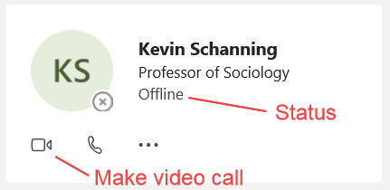

## Setting-up Teams

* Open up your webmail from [my.northland.edu](https://my.northland.edu/){:target="_blank"} (link at the very bottom of the page or [use this](https://my.northland.edu/web-mail/){:target="_blank"}). Select "Go" after "Student email >".
* In the ensuing page select the "Teams" icon.

* You will be asked to install the app. If you are using your own computer you may want to do this for simplicity. Note that you may need to set the security options on your computer to allow the app to access your computer's camera.
* With the app or the web-based verson you will need to answer some simple configuration questions.

 

If you did not set-up the Teams app and are running Teams through the web interface then you will need to use the Chrome or Edge browsers to make a video call (Teams does not support Internet Explorer, Firefox, or Safari for making video calls).

## Calling Derek
#### Set-up A Speed Dial

* Select "Calls" from left-side menu.
* Select "Speed Dial" near top left (likely already selected).
* Select "Add Speed Dial" from near upper-right.
* In the ensuring dialog box, type my name ("Derek Ogle"). As you type you will eventually see my name appear in a drop-down box. Select my name in that box. Press "Add".
* You should then see a "contact card" for me in your speed dial list.

#### Calling Derek with Speed Dial

* Select "Calls" from left-side menu.
* Select "Speed Dial" near top left (likely already selected).
* Find my "contact card" in your list of speed dial contacts. [Example below is for my friend Dr. Kevin Schanning ... don't contact him! &#x1F601;]

* Press the icon that looks like a little video camera to video-call me. Note that my availability will be shown in the "status" portion of my contact card.
