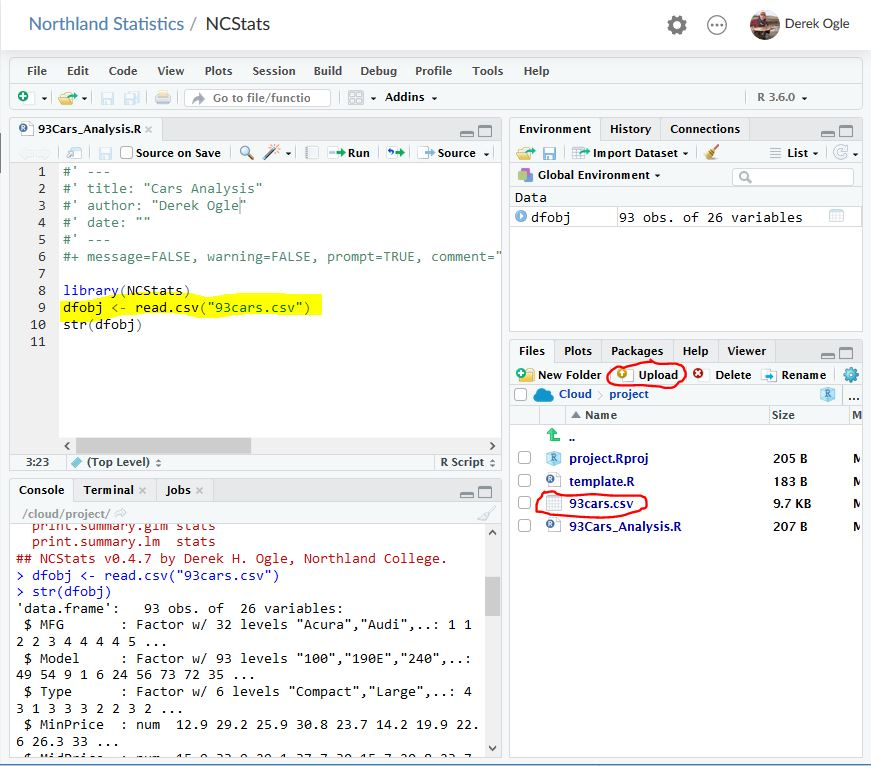

Analyses with R and RStudio can be run on through a web browser on "the cloud", thus eliminating the need (and sometimes hassle) to install these softwares and the associated packages on your computer. Follow the directions below if you would like to try using R/RStudio in the cloud.

## Creating an RStudio Cloud Account
You must create a free RStudio Cloud account to use this service. Go to the [RStudio Cloud website](https://rstudio.cloud/) and select "Get Started." In the ensuing dialog box enter your e-mail adddress, a password, and your first and last names. Press "Sign up."

In a subsequent screen you will be asked to provide a name for the account with prompts to use your first and last name. Just press "Create Account" here.

After this you should successfully have an RStudio Cloud account.

 

## Getting Your Own MTH107 Project

Once you have created your account, follow [this link to the "MTH107" project](https://rstudio.cloud/project/1767444){:target="_blank"}, which should open a project that looks like that below. Currently this project is in my "workspace." Click on the red "Save a Permanent Copy" item in the top bar to save the project to your workspace.

Any changes that you make to the project (uploading files, creating scripts) will be saved in this project in your workspace. *If you do not save a permanent copy then any work that you do in the project will be lost when you come back to it.*

RStudio-in-the-cloud operates the same as RStudio with the exception that RStudio-in-the-Cloud cannot access data from your computer, which is described in the next section.

 

## Loading Data
Data stored in a CSV must first be uploaded to the "RStudio Cloud" before reading into RStudio with `read.csv()`. To upload a CSV that is on your computer into "RStudio Cloud" select the "Upload" button in the "Files" tab in the lower-right pane of RStudio. Then "Browse ..." to where your file is located and select OK. The CSV file will now appear in the Files pane (see below). This file is then read into "RStudio Cloud" by including the filename in `read.csv()` (note that you do not need to worry about setting the working directory with `setwd()`).

