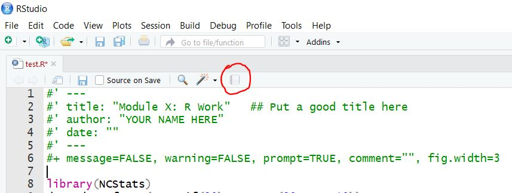
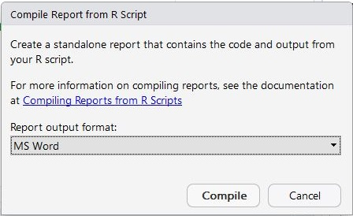

----

In several exercises you will create an script of R commands that will perform certain calculations or produce certain graphs. I will ask that you demonstrate your R code by printing your R script along with the results it produce.

RStudio can compile a script into a report by presssing the "Compile Report button" in the script pane toolbar (see below).



In the ensuing dialog box (below) select "MSWord" to compile the script and results in Microsoft Word.



Unfortunately, this document is a bit "spacious" and thus wastes paper. You can control some of the issues by including the following code at the top of your script (simply copy all lines below into the first eight lines of your script and then change the title and author).

```
#' ---
#' title: "Module X: R Work"   ## Put a good title in the quotes
#' author: "YOUR NAME HERE"
#' date: ""
#' ---
#+ message=FALSE, warning=FALSE, prompt=TRUE, comment="", fig.width=3

library(NCStats)
```

When you compile this report the document should be a little more concise then the default would have been.

A video demonstrating this process is embedded below (or at [this link](https://vimeo.com/313195664)).

<iframe width="640" height="564" src="https://player.vimeo.com/video/313195664" frameborder="0" allowFullScreen mozallowfullscreen webkitAllowFullScreen></iframe>


## Additional controls

In some instances you may want more fine control over the width of the outputted figures. For example, you may have two side-by-side plots in one figure and thus need the figure to be twice as wide or you just want a bigger figure to see more details. You can control the width and height of the figure by include the following line RIGHT BEFORE where the plot is made.

```
#+ fig.width=4, fig.height=4
```

This will, however, change the overall settings, so you will need to repeat what we did in the header to bring back the original settings. Therefore, you may want to include this line RIGHT AFTER where the plot was made.

```
#+ message=FALSE, warning=FALSE, prompt=TRUE, comment="", fig.width=3
```
