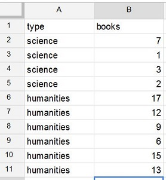
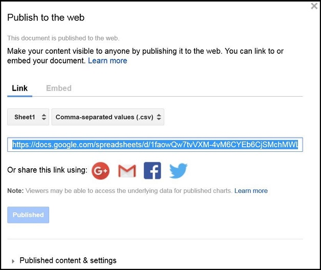

```{r echo=FALSE, eval=FALSE}
# Renders an appropriate HTML file for the webpage
setwd("C:/aaaWork/Web/GitHub/NCMTH107/resources/FAQ/FAQs")
source("../../../rhelpers/rhelpers.R")
fnm <- "enter-data-google-sheets"
modHTML(fnm)
```

```{r echo=FALSE, results='hide', message='FALSE'}
source("../../../rhelpers/knitr_setup.R")
```

----

Data may be entered into a Google Sheet and then loaded into RStudio with the following steps.

* Open Google Sheets.
* Enter the data with each variable in a separate column and each individual in separate rows.  Make sure that the first row contains the variable names (without spaces).



* Rename the sheet (click on "Untitled spreadsheet" and give a new name).
* Publish the sheet to the web by selecting the `File` menu and the `Publish to the web` submenu.  In the ensuing dialog box, change "Entire Document" to "Sheet1" and "Web Page" to "Comma-separated values (.csv)".  Then press the `Publish` button and press `OK` when asked to confirm publishing.  The dialog box will now look similar to that below.



* Select and copy (CTRL-C or CMD-C) the entire link shown in the box above.
* Open RStudio.
* Enter and run the line below (but with your link between the quotes).

```{r}
df <- read.csv("https://docs.google.com/spreadsheets/d/1faowQw7tvVXM-4vM6CYEb6CjSMchMWLh17S5FWh1Pt4/pub?gid=0&single=true&output=csv")
str(df)
df
```
