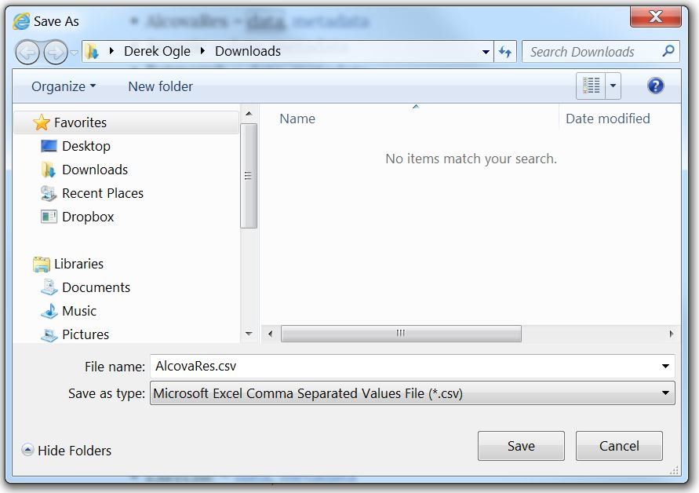
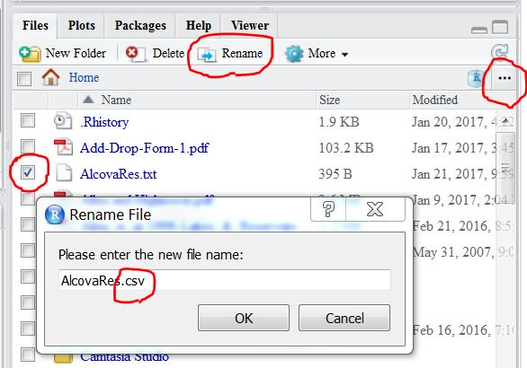

----

Downloading CSV files that I have made available for you is described in [this FAQ](where-data). However, for some computers and browsers, the CSV file downloads a ".txt" rather than a ".csv" file. This problem and a solution is described below.

## The Problem

CSV data files that I provide are [available here](../../data_107). Generally, a specific file is downloaded by right-clicking on the "data" link and selecting "Save Target As", "Save Link As", or "Save As" depending on which browser you are using. This brings up a dialog box in which you can choose a location to save the file. This is demonstrated for Internet Explorer on my computer below.



Ideally the "Save as type:" box will contain a ".csv" item as shown above. However, in some instances this box will say (and only allow) "Text Files". If this is your case, then the file will be downloaded as a ".txt", rather than a ".csv" file, which will cause some issues when loading the data into RStudio. A fix for this problem is described below.

## A Solution

The following steps will correct the problem described above.

1. In RStudio, select the "Files" tab in the lower-right pane.
1. Use the "..." button on the far-right of that pane (see below) to open a dialog box in which you can browse to where you saved your file.
1. In the list of files, select the box to the left of the file that you downloaded above (in this example, that is "AlcovaRes.txt"; see below).
1. Press the "Rename" button at the top of the Files pane and change the ".txt" portion of the file name to ".csv" (see below). Press OK.



You can now load this file into RStudio as described in [this R Tutorial video](https://vimeo.com/user45324800/ncstats-loadcsvrstudio).

----

## Footnote

The file downloaded from the webpage is actually a CSV file that the browser simply mislabels. Thus, the file can be loaded with `read.csv()` as long as one enters the correct (i.e., mislabelled) name. For example, if the solution steps above were NOT followed, then this code should work.

```
dfobj <- read.csv("AlcovaRes.txt")
```

----
