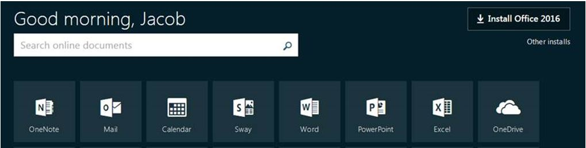

----

As a student at Northland College, you have no-cost access to Microsoft Office products (Word, Excel, etc.). Many students use these programs through "online" versions. However, the "online" versions are not fully functional, which limits their use in this class. To install the "full" versions of these programs on your personal computer, logon on to your computer in the same way that you would to check your Northland e-mail, which should give you a screen similar to that below. Here, select the "Install Office 2016" icon (on the right) and follow the directions.

The only constraint to using these programs is that you will need to be logged onto your computer with your Northland e-mail address (this is how the software validates that you are allowed to use it at no cost).

----
