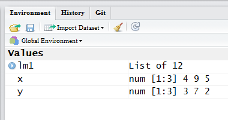

```{r echo=FALSE, eval=FALSE}
# Renders an appropriate HTML file for the webpage
setwd("C:/aaaWork/Web/GitHub/NCMTH107/resources/RFAQ/FAQs")
source("../../../rhelpers/rhelpers.R")
fnm <- "object-names"
modHTML(fnm)
```

```{r echo=FALSE, results='hide', message='FALSE'}
source("../../../rhelpers/knitr_setup.R")
```

----

Results are often saved to objects in R for later retrieval and use.  For example, the following lines create several objects in R.
```{r}
y <- c(3,7,2)
x <- c(4,9,5)
lm1 <- lm(y~x)
```

If you create many poorly named objects you may lose track of the object names that you have created.

There are at least three methods for remembering object names.  First, look back through your script to see where you created objects.  Second, use the "list" function to show object names in R's global environment (**note some other objects required to produce this FAQ are also shown here**).
```{r}
ls()
```

Third, if using RStudio, examine the "Environment" pane (in the upper-right pane if you did not reorganize RStudio).


