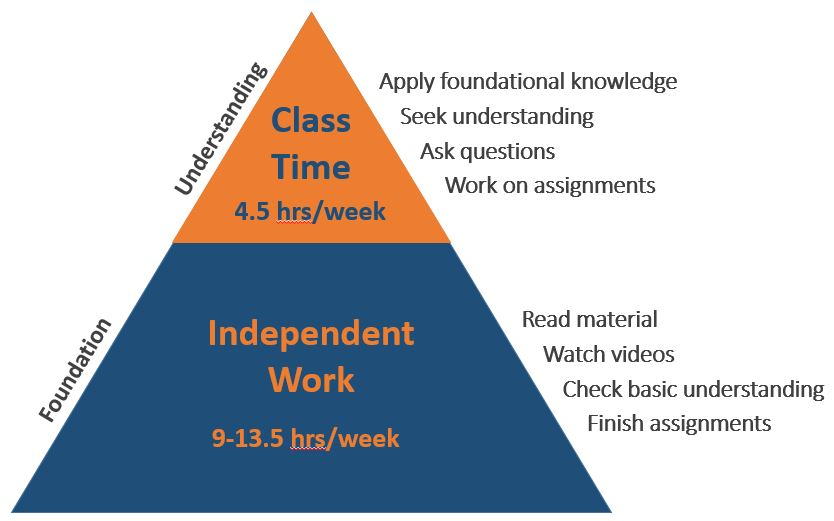
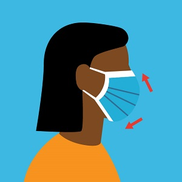

<ul>
  <li>How do we learn from raw data?</li>
  <li>How does statistics further science?</li>
  <li>How do I not get fooled by other people's numbers?</li>
</ul>

<figure>
  
  <figcaption>From <a href="http://phdcomics.com/comics/archive.php?comicid=1271" target="_blank">phdcomics.com</a></figcaption>
</figure>

 

What you learn in this <strong>Statistical Concepts and Analysis</strong> course will help you answer these questions.

----

## Syllabus Contents

* [Catalog Description](http://catalog.northland.edu/preview_course_nopop.php?catoid=19&coid=13534){:target="_blank"} and [Learning Outcomes](#learning-outcomes)
* [Assistance](#assistance) -- [Instructor](#instructor--derek-ogle), [Tutors](#tutors), [Accommodations](#accommodations), and [Academic Alerts](#academic-alerts)
* [Course Workflow](#course-workflow)
* [Grading](#grading) -- [Incompletes](#incomplete-grades) and [Midterms](#midterm-grades)
* [Expectations](#expectations) -- [Ownership of Learning](#ownership-of-learning), [Work Outside of Class](#work-outside-of-class), [Classroom Conduct and Academic Integrity](#classroom-conduct-and-academic-integrity)
* [COVID-19 Statement](#covid-19-statement)

----

## Learning Outcomes

In this course, you will have the opportunity to:

1. Describe why statistics is central to scientific inquiry (& your field of interest); 
1. Define basic statistical words and symbols; 
1. Design simple **experiments** and **sampling** strategies; 
1. Perform appropriate **exploratory data analyses** (univariate and bivariate); 
1. Identify the purposes of and conduct and interpret the results of a **linear regression**; 
1. Construct and interpret confidence intervals for **one and two-sample mean and proportion** problems;
1. Identify the appropriate hypothesis test to perform in **one- and two-sample quantitative and categorical** data situations; 
1. Construct and interpret the results from a hypothesis test for **one- and two-sample quantitative and categorical** data situations; and 
1. Communicate statistical results and ideas in a succinct and informative manner. 

This course fulfills that Quantitative Reasoning requirement in the [General Education Program](https://my.northland.edu/faculty/fac-academic-programs/){:target="_blank"} because you will:

* Communicate mathematical information symbolically, visually, numerically, and verbally;
* Use statistical or mathematical models in solving problems; and
* Think critically about the validity of conclusions that are based on statistical or mathematical models.

----

## Assistance

> Don't be afraid to ask questions. Don't be afraid to ask for help when you need it. I do that every day. Asking for help isn't a sign of weakness, its a sign of strength. It shows you have the courage to admit when you don't know something, and to learn something new. -- President Barack Obama

### Instructor -- Derek Ogle

I will answer to "Derek", "Doctor Ogle", "Professor Ogle", or "Doctor Professor Ogle, Sir" ... whichever you prefer. &#x1F600;

I am committed to your doing well in this course and see it as my responsibility to help you both in and out of the designated class period. There are several good ways to get help from me.

- Attend class.
- I will not hold "drop-in" office hours at dedicated times. However, if you send me an e-mail I will create a "virtual" meeting where we can talk either by phone or video and, if necessary, I can show you my screen or you can show me yours. As a general rule I will be available in the late afternoons and early evenings, so as to minimize conflict with your afternoon classes. These "virtual" meetings will be conducted through MSTeams (I will send you a link with an invitation to join, but you can also see [these directions](FAQs/MicrosoftTeams){:target="_blank"}).
- Ask me and other students (anonymously to them) questions on the Piazza Class Discussion Site ([see link on class homepage](../){:target="_blank"}), which I will monitor regularly ([here are directions for how to post a question](https://support.piazza.com/support/solutions/articles/48000574396-students-post-a-question){:target="_blank"}).
- Finally, you may send me [anonymous feedback, suggestions, or questions](https://www.surveymonkey.com/r/KC87PJW){:target="_blank"}.

Please see or contact me if you have questions regarding this course. 

### Tutors

Markia Smith will also be available to help you succeed in this course. Markia is a Math and Education major who took this class two years ago and will be tutoring stats for her second year. Markia's tutoring hours are XXX and XXX from XXX to XXXpm. **You must register to meet with Markia at least one hour in advance of these times** ([see here for how to register and join the tutoring session](How to make an appointment with a tutor.pdf)).

&nbsp;

&nbsp;

&nbsp;

Danielle Hewitt will also be available to help you succeed in this course. Danielle is a Pschology and Business major who took this class last year and will be tutoring stats for the first time this year. Danielle is also one of your co-presidents for NCSA. Danielle's tutoring hours are XXX and XXX from XXX to XXX pm. **You must register to meet with Danielle at least one hour in advance of these times** ([see here for how to register and join the tutoring session](How to make an appointment with a tutor.pdf))

### Accommodations
I want to create an inclusive and accessible learning environment for those of you that have a condition (e.g., attention, learning, vision, hearing, mental, physical, or other health-related concern) that may require special accommodations. *If you have already established accommodations* with the Office of Accessibility Resources (OAR), please communicate your approved accommodations to me as soon as possible so that we can discuss your needs in this course. If you have a condition that requires accommodations but *you have not yet established services* through OAR, then you should contact Jennifer Newago as soon as possible (Ponzio 230, x1387, or <a href="mailto:accommodations@northland.edu">accommodations@northland.edu</a>). It is the policy and practice of Northland College to create inclusive and accessible learning environments consistent with federal and state law. <a href="https://my.northland.edu/life/be-healthy/accommodations/">More information is available here.</a>

### Academic Alerts
If I observe you "struggling" with the course early in the semester then I may file an "Academic Alert" about you. If this happens, you will receive an e-mail from me that will suggest steps you can take to improve your performance in the course. Our Academic Success Coordinator, Megan McPeak, will receive the alert and will likely also reach out to you. **Academic Alerts are not punitive**, they are simply an attempt to help you get back on track in this course as soon as possible.

----

## Course Workflow

The course is scheduled to meet every weekday from 830-1130am. However, because of physical distancing guidelines, half of you will meet with me in the classroom at 830 and the other half of you will join the class on-line through my.northland (see [quick link on the class homepage](../)). After an introductory review "lecture" that will be between 15 and 60 minutes, the "in-person" students will stay and work on the assignment with me until 1015am. The other group of students will then come to class to work on the assignment with me from 1030 to 1130am. I will expect that you are working on the assignment when not in class during the 830-1130am window and at other times as needed.

This course is taught in a "flipped format", which loosely means that you will be responsible for obtaining factual content prior to coming to class and will then use class time with me to apply and expand upon what you learned prior to class. I have taught this class in this format for five years, largely because I believe the science that indicates that deeper learning is achieved with this model. However, this format also allows for teaching face-to-face, on-line, or a hybrid of both as necessary.

The course is composed of [25 modules](../modules/index) of material which roughly corresponds to one module per day. Below describes a general format of instruction that you should follow for each module.

1. **Prepare Module Material** -- Each module has questions that will guide your preparation for that module's material. These questions are below the "Preparation for Class" heading on each module webpage (see ["Foundational Definitions"](../modules/FoundationalDefns){:target="_blank"} as an example). Prior to the class period dedicated to a module (see the [Dates page](Dates-Current.html)) you will use written and video materials to answer the preparation questions. Additionally you may ask relevant questions about the material on the Piazza discussion site ([quick link on class homepage](../){:target="_blank"}).
1. **Complete Module Preparation Quiz** -- Each module has a "module preparation quiz" that will be available on the class Gradescope page ([quick link on class homepage](../){:target="_blank"}). These quizzes will be named after the module and will include the "-- Prep Check" suffix. Between 1pm on the day before and 8am on the day of the class period dedicated to a module, you should complete and submit the corresponding "module preparation quiz." While taking this quiz you may refer to your notes, the readings, or the videos. You will receive a short e-mail from me when your graded quiz is available on GradeScope.
1. **Class Time** -- The initial part of "in-person" class for one group and "virtual" for teh second group will consist of a short review of the module material. The "in-person" portions of the class following that will consist of work on application exercises. You are expected to attend the first portion of each period either "in-person" or "virtually" and the second portion "in-person" as this will be a time to get direct help from me. You are expected to work on course material during the portion of the 830-1130 period when you are not "attending" class. You will start and likely finish most of the required assignments during this time.
1. **Complete an Applied Assignment** -- Each module has an assignment where you will apply the module's concepts. The assignment is listed under the "Practice" section on the module webpage (see ["Foundational Definitions"](../modules/FoundationalDefns){:target="_blank"} as an example). Assignments can be typed or (neatly) hand-written and will ultimately need to be turned into a PDF document for online submission to Gradescope ([quick link on class homepage](../){:target="_blank"}). [The first two pages of these directions](https://gradescope-static-assets.s3-us-west-2.amazonaws.com/help/submitting_hw_guide.pdf){:target="_blank"} show how to use your device to scan hand-written work to a PDF. [The last page of those directions](https://gradescope-static-assets.s3-us-west-2.amazonaws.com/help/submitting_hw_guide.pdf){:target="_blank"} shows how to upload your PDF to Gradescope and identify the page on which each answer appears (this is required). The assignment on Gradescope will have the module name and "-- assignment" suffix and are due by 8am on the day after the class period dedicated to the module. You will receive a short e-mail from me when your graded assignment is available on GradeScope. You are expected to review your grade and comments ([how-to video here](https://youtu.be/TOHCkI12mh0){:target="_blank"}) to better learn the material and to improve on future assignments. Detailed answer keys will also be available on the module webpage.

 

----

## Grading

An overall grade will be computed from the module preparation quizzes and assignments described  in the ["Course Workflow" section](#course-workflow) and a final exam. Module preparation quizzes and assignments not submitted by the due date time will not be accepted. However, your lowest four quiz AND assignment grades will be dropped when computing your overall grade. The final exam is an opportunity for you to show a synthetic understanding of all material from throughout the course. The final exam will focus on larger concepts, applications, and interpretations (rather than specific details) from throughout the semester. I will provide you with an explicit study guide approximately one week before the final exam.

An overall score will be computed from the items and associated weights listed in the table below. Grades on individual module preparation quizzes and assignments can be found on the class Gradescope page ([quick link on class homepage](../){:target="_blank"}. I will update your percentage grades for the Preparation Check Quizzes and Module Assignments on mycourses.northland.edu ([quick link on class homepage](../) at the end of each week, which will then show your grade as of that time. You can also compute your overall grade at any time by entering your percentage scores in the boxes below for completed assessments. To project your future grade, also include percentages for future assessments.

<!-- if the assessment weights change then you must change the values in get_wghts() in the grader.js file -->

<form name="GRADECALC">
<table class="grader" width="70%">
<tr><th width="15%"></th>
<th width="28%">Prep Check Quizzes</th>
<th width="28%">Assignments</th>
<th width="29%">Final Exam</th>
</tr>

<tr style="vertical-align:bottom"><th>Weight</th>
<th>15% </th>
<th>60% </th>
<th>25% </th></tr>

<tr><th>Percent</th>
<td><input type="text" name="PREP_SC" size="3" tabindex="1" onchange="calc_grade(this.form)"></td>
<td><input type="text" name="HW_SC" size="3" tabindex="2" onchange="calc_grade(this.form)"></td>
<td><input type="text" name="FNL_SC" size="3" tabindex="3" onchange="calc_grade(this.form)"></td>
</tr>

<tr><th colspan="2">Overall: <input type="text" name="SCORE" size="4"></th>
<th colspan="2">Grade: <input type="text" name="GRADE" size="2"></th></tr>
</table>
</form>

Your letter grade will be assigned from your overall percentage (rounded to a whole number) and the table below.

<table class="tg">
  <tr><td></td><td>A 92-100</td><td>A- 90-91</td></tr>
  <tr><td>B+ 87-89</td><td>B  82-86</td><td>B- 80-81</td></tr>
  <tr><td>C+ 77-79</td><td>C  70-76</td><td></td></tr>
  <tr><td>D+ 67-69</td><td>D  60-66</td><td>F   0-59</td></tr>
</table>

#### Incomplete Grades
An incomplete grade will be given ONLY in extreme circumstances that are beyond your control, such as a major illness, and will ONLY be given if you have successfully completed the entire course except for the final exam. This is in accordance with [Northland College policy](https://my.northland.edu/student-policies/academic-policies/#grades){:target="_blank"} (scroll down to "Incomplete Grades").

#### Midterm Grades
I will submit a "midterm grade" for you approximately half-way through the semester. This grade will by my best guess at your lowest possible final grade. I assign this "worst-case" midterm grade because I believe that it is better to know the worst rather than the best-case scenario at that point of the semester and the material at the end of the semester is a little more difficult than the material at the beginning of the semester. Of course, see me if you have questions about your midterm grade.

----

## Expectations

### Ownership of Learning

This course is designed in a way that you will have to actively, rather than passively, engage in the course content. In this way, it may differ from some of your other courses. In particular, in this course you will need to:

* Interact with the course material **daily**.
* Multi-task material from multiple modules (i.e., you may be finishing the assignment for one module while preparing for the next module).
* Prepare for some course content on your own prior to class.
* Use class and the Piazza discussion site to ask questions and seek help.
* Assess your own performance by reviewing your graded work an comparing your answers on assignments to the answer key (which will also contain hints related to common mistakes).
* Assess if you need more practice and complete additional exercises provided for most modules.
* Ask for help from me (the professor) both during and outside of class. See [Assistance](#assistance) section above.
* Maintain focus for an extended period of time (1.5 h for each class).

### Work Outside of Class

As a general rule-of-thumb[^studytime], you are expected to spend 2-3 hours of time outside of class for each hour in class. For this course, you will meet for 7.5 hours per week and, thus, you should dedicate between 15 and 22.5 hours of time outside of class time preparing for class, completing assignments, reviewing your work, and asking questions or for help. **The work required for this course can be completed within this expected amount of time, if that time is without distraction**. If monitoring your phone/device is distracting you from getting your work done then you may consider the aid of apps (e.g., [Forest](https://www.forestapp.cc/)) designed to reduce distractions from devices.[^DistractionAids]  

If you feel that you are spending too much time on some assignments or preparations because you are "stuck," then start your work earlier so that you can stop (and do other things) and make plans to seek help (see [assistance section above](#assistance)).

### Classroom Conduct and Academic Integrity

My intent is to create a classroom environment where learning can occur. One part of this environment is a well-organized course structure built upon relevant learning resources and interesting realistic exercises. Another part is my availability to assist you in learning from these resources and exercises. A third part is your conduct within the classroom. My expectations of you are that you will fully engage in the course (see above) and be respectful of all others in the class. At a minimum, I expect you to adhere to the following behaviors:

* Please arrive to class on time. If you arrive late, then take the first available seat as quietly as possible. If you need to leave early, then please sit near the exit.
* Please attend the entire class period. Leaving class early defeats the purpose of the class period, does not take advantage of resources (i.e., the professor) that can significantly help your learning, and does not build statistical stamina. Please take care of your personal needs (e.g., using the restroom) before class so that you can stay focused for the entire class period.
* Please turn your computer on immediately so that you can promptly begin the daily preparation check.
* Please limit computer use to class work.
* Please turn off and store out-of-sight cell phones and other electronic devices (except for your computer).
* Please **do not listen to music** (or otherwise wear ear buds) during class.
* Please do not have side discussions while I or others are speaking to the entire class.
*	Please do not sleep in class -- this is rude and distracting to others.
* Please do not use disrespectful language when addressing others.

Finally, note that the [College's Academic Integrity Statement & Policy](https://my.northland.edu/student-policies/academic-policies/#academic-integrity){:target="_blank"} will be followed in this course. Please make sure that you are familiar with its content.

---

## COVID-19 Statement

As you are aware, the circumstances surrounding COVID-19 are ever-changing. Thus, it is possible that the college may make decisions that will affect how this course is administered. In addition, you may miss some class periods out of an abundance of caution if you are ill. I have designed the course to "work" whether we are face-to-face, remote, or somewhere in between. If you should have to miss class for any reason, please e-mail me promptly to explain to me your situation. I will work with you to help you stay up with class material as best as possible. If face-to-face classes are canceled then I will communicate with you promptly about how we will continue with class. **Communication will be key to stay abreast of the current situation and how it relates to our class ... so please keep me informed of your circumstances and regularly monitor your Northland e-mail.**

It is my hope that we can maintain a face-to-face classroom for the entire session. You can help with this by doing the following things related to our class.

- Monitor your temperature and check for symptoms of COVID-19 as described under "DAILY SELF CHECKS" on [this page](https://www.northland.edu/about/reopening-plan/#beahviors-that-reduce-spread){:target="_blank"}. If your temperature is elevated or you have symptoms please don't come to class, notify the [Office of Health Services](https://www.northland.edu/dir/jennifer-newago/){:target="_blank"}, and notify me.
- Thoroughly [wash your hands](https://www.northland.edu/about/reopening-plan/#hand-hygiene){:target="_blank"} prior to entering the classroom.
- Please [properly wear your mask](https://www.hopkinsmedicine.org/health/conditions-and-diseases/coronavirus/proper-mask-wearing-coronavirus-prevention-infographic){:target="_blank"} at all times when entering the building and the classroom. This is in compliance with [Northland's face covering policy](https://my.northland.edu/student-policies/student-rights/#covid-face){:target="_blank"}. &#x1F637;
- Please enter the back (south) door and exit the front (north) door to the classroom (the doors will be marked).
- Maintain proper [physical/social distance](https://www.northland.edu/about/reopening-plan/#social-distancing){:target="_blank"} (six feet) from other students while in the classroom. In our computer classroom, please only sit at a desk that has both a chair and a computer.
- Wipe down your desk, keyboard, and mouse with the provided wipes. **You are also welcome to bring and use your own computer.**
- In general, but especially if you are using the college's computers, please refrain from touching your face (mouth and eyes) with your hands.
- Communicate issues to me (see [ways to communicate to me above](#instructor--derek-ogle)) so that I am aware and can try to address the issues.

I will follow the college's official policy with respect to COVID-related absences.[^CovidAbsence] If you miss your designated class period then you may remotely attend the 830-930 class period via the appropriately dated "online meeting" on our mycourses.northland.edu page ([see quick link on class homepage]("../"){:target="_blank"}. Most class periods will begin with a brief introductory "lecture" that summarizes (with your help) the material that you prepared for the day's module. Then, as noted above, the rest of the class periods will be for working on the module assignment and asking me for help. A recording of the session will also be made and can be accessed from the same mycourses.northland.edu page.

----

### Footnotes

[^email]: While I am pretty open-minded and not much of a stickler when it comes to e-mail etiquette, some professors are. And it is always better to send an appropriate rather than an inappropriate e-mail. [Here](https://www.scribendi.com/advice/how_to_email_a_professor.en.html) and [here](https://www.insidehighered.com/views/2015/04/16/advice-students-so-they-dont-sound-silly-emails-essay) are some good suggestions for e-mailing professors.

[^studytime]: General advice for how much time should be spent outside of class for each hour inside of class can be found, among many, [here](https://www.collegeparentcentral.com/2010/02/is-your-college-student-investing-enough-time-studying/){:target="_blank"}, [here](http://classroom.synonym.com/ratio-studying-class-time-college-1075.html){:target="_blank"}, [here](https://www.usu.edu/asc/studysmart/pdf/estimating_study_hours.pdf){:target="_blank"}, and [here](http://collegelife.about.com/od/academiclife/f/How-Much-Time-Should-I-Spend-Studying-In-College.htm){:target="_blank"}.

[^DistractionAids]: Also see the following resources for other apps that may help you eliminate distractions from your devices ... [here](https://georgehalachev.com/2019/01/15/7-apps-that-will-help-you-beat-procrastination/){:target="_blank"}, [here](https://www.careercontessa.com/advice/best-apps-chronic-procrastinator/){:target="_blank"}, [here](https://highschoolhints.com/6-apps-that-will-stop-your-procrastinating/){:target="_blank"}, or [here](https://remotebliss.com/procrastination-apps/){:target="_blank"}.

[^CovidAbsence]: If a student feels ill, has an elevated temperature, or a positive symptom check relevant to COVID-19, they should not attend in-person classes or activities, but remain at home (their room if they live on campus).  They will not be penalized for their absence(s), as long as they notify their instructors of an illness prior to the beginning of the class session or activity.  The student should notify the office of Health Services about their positive temperature or COVID-19 symptom check.  If the Office of Health Services obtains a positive COVID-19 test from a student or determines that as a result of a known contact a student should be quarantined, the Office will notify instructors of a student’s absence from class for an undetermined duration.  Students who miss in-person classes or activities because they have been quarantined, in isolation, or because they are ill, either as a consequence of COVID-19 or otherwise, will not be penalized for their absences.  When a student is able, they are expected to keep up with class material that is available to them online, complete and submit assignments and to participate in virtual course activities, when such virtual activities are available.  Otherwise, the instructor will work with the student to arrange for appropriate extensions for required assignments.
