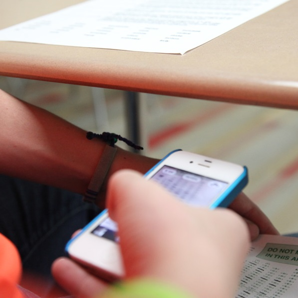

* Class [Description](#description) and [Learning Outcomes](#learning-outcomes)
* [Instructors](#instructor) and [Tutors](#tutors)
* [Grading](#grading) -- [Preparation Check](#preparation-check), [Participation](#participation), [Quizzes](#quizzes), [Extra Credit](#extra-credit)
* [Classroom Conduct and Academic Integrity](#classroom-conduct-and-academic-integrity)
* [Accommodations](#accommodations)

----

## Description

Introduction to the concepts and interpretation of statistics. Summary graphs and statistics; data production (sampling and experiments); random variables and sampling distributions; inference - introduction, for distributions, for proportions; correlation and regression. Prerequisite: MTH103, ACT math > 17, or SAT math > 470. 4 Credits.

## Learning Outcomes

At the end of this class you will be able to ...

1. describe why statistics is central to scientific inquiry (& your field of interest); 
1. define basic statistical words and symbols; 
1. design simple experiments and sampling strategies; 
1. perform appropriate exploratory data analyses (univariate and bivariate); 
1. identify the purposes of and conduct and interpret the results of a linear regression; 
1. construct and interpret confidence intervals for one and two-sample mean and proportion problems;
1. identify the appropriate hypothesis test to perform in one- and two-sample quantitative and categorical data situations; 
1. construct and interpret the results from a hypothesis test for one- and two-sample quantitative and categorical data situations; and 
1. communicate statistical results and ideas in a succinct and informative manner. 

We will focus on the understanding of statistical concepts and proper interpretation of statistical results.

----

## Instructor

<table class="tutors" width="60%">
<tr><th><a href="http://derekogle.com" target="_blank">Dr. Derek H. Ogle</a> Professor of Mathematical Sciences  & Natural Resources</th></tr>
<tr><th></th></tr>
<tr style="vertical-align:top"><td>CSE228; 682-1300 <a href="mailto:dogle@northland.edu">dogle@northland.edu</a> 
<a href="https://www.surveymonkey.com/r/KC87PJW" target="_blank">Anonymous Feedback / Suggestions</a></td></tr>
<tr style="vertical-align:top"><td>Office Hours: 
MWF 1230-230 By Appointment</td></tr>
</table>

## Tutors

<table class="tutors" width="90%">
<tr><th width="50%"></th><th width="50%"></th></tr>
<tr><th>Adam Gunnelson</th><th>Emily Mader</th></tr>
<tr style="vertical-align:top"><td>Adam is a chemistry major and math minor. He is a bow-tie enthusiast, and enjoys helping people with math.</td><td>Emily is a math major and physics minor. She enjoys playing softball, being outdoors, and, of course, mathematics!</td></tr>
<tr style="vertical-align:top"><td>XXX XXX</td><td>XXX XXX</td></tr>
</table>

----

## Grading
An overall score will be computed from the items and associated weights listed in the table below. To compute your current grade, enter your percentage scores in the boxes for completed assessments. Enter your highest quiz score as the first quiz and your lowest quiz score as the last quiz. To project your future grade, also include percentages for future assessments. [*It is your responsibility to track your scores on the individual assessments.*]

<!-- if the assessment weights change then you must change the values in get_wghts() in the grader.js file -->

<form name="GRADECALC">
<table class="grader" width="90%">
<tr><th width="14%"></th>
<th width="13%"><a href="#preparation-check">Prep Check</a></th>
<th width="13%"><a href="#participation">Partici- pation</a></th>
<th width="12%"><a href="#quizzes">Quiz 1</a></th>
<th width="12%"><a href="#quizzes">Quiz 2</a></th>
<th width="12%"><a href="#quizzes">Quiz 3</a></th>
<th width="12%"><a href="#quizzes">Quiz 4</a></th>
<th width="12%"><a href="#quizzes">Final</a></th>
</tr>

<tr><th>Weight</th>
<th>10%</th><th>10%</th><th>15%</th><th>12.5%</th><th>12.5%</th><th>10%</th><th>30%</th></tr>

<tr><th>Percent</th>
<td><input type="text" name="READ_SC" size="3" tabindex="1" onchange="calc_grade(this.form)"></td>
<td><input type="text" name="PART_SC" size="3" tabindex="2" onchange="calc_grade(this.form)"></td>
<td><input type="text" name="Q1_SC" size="3" tabindex="3" onchange="calc_grade(this.form)"></td>
<td><input type="text" name="Q2_SC" size="3" tabindex="4" onchange="calc_grade(this.form)"></td>
<td><input type="text" name="Q3_SC" size="3" tabindex="5" onchange="calc_grade(this.form)"></td>
<td><input type="text" name="Q4_SC" size="3" tabindex="6" onchange="calc_grade(this.form)"></td>
<td><input type="text" name="FNL_SC" size="3" tabindex="7" onchange="calc_grade(this.form)"></td>
</tr>

<tr><th colspan="4">Overall Percentage: <input type="text" name="SCORE" size="4"></th>
<th colspan="4">Projected Grade: <input type="text" name="GRADE" size="2"></th></tr>
</table>
</form>

Letter grades will be assigned by comparing your overall percentage (rounded to a whole number) to the values shown below:

<table class="tg">
  <tr><td></td><td>A 92-100</td><td>A- 90-91</td></tr>
  <tr><td>B+ 87-89</td><td>B  82-86</td><td>B- 80-81</td></tr>
  <tr><td>C+ 77-79</td><td>C  70-76</td><td></td></tr>
  <tr><td>D+ 67-69</td><td>D  60-66</td><td>F   0-59</td></tr>
</table>

### Preparation Check
You should prepare for each class period by reading the reading and watching the videos for the module indicated on the [Dates page](Dates-Current) and announced at the end of the previous class period. A preparation guide is provided for each module to help you identify key concepts in the reading and videos ([here's an example](../modules/FoundationalDefns_Prep.html){:target="_blank"}). You should prepare your own **hand-written**[^1] answers or notes to each question on the preparation guide. A "preparation check survey" will be administered during the **FIRST 8 minutes of EVERY** class period. You may use your hand-written notes, but no other resources, for these checks. **Preparation check surveys not completed in the first 8 minutes of class cannot be made up. Preparation check surveys taken from outside of the classroom will not be accepted.**

### Participation
This class is taught in an active learning format. Outside of class you will be asked to prepare a module for each class period (as described above) and complete exercises begun in class. Your preparation outside of class will be assessed by me periodically (*without prior notice*) collecting evidence for your preparation. Such evidence may include your written answers to the preparation guide (described above) or your written answers to exercises that were to be completed outside of class. These items will largely be graded on a "did you do it" basis, but points may be deducted for class exercises that are grossly incorrect.

In class you will be asked to actively participate (listen, take notes) in short lectures, work on in-class exercises, ask questions of other students and the instructor, and, occasionally, work in small groups. Our time during class is short and precious, thus you will need to be focused and attentive during the entire class period. To encourage your full participation, I will assess your level of participation at the end of each class period with the following rubric.

  <table class="table table-bordered">
  <thead>
    <tr class="info"><th>0 points</th><th>1 point</th><th>2 points</th></tr>
  </thead>
  <tbody>
    <tr><td>Very little active participation in the day's activities. Lacked focus. Left more than 30 mins early.</td><td>Participated in many, but not all, of the day's activities. Focus waned or was inconsistent. Left between 1-30 mins early.</td><td>Fully (see below) participated in the day's activities. Properly focused at all times.</td></tr>
  </tbody>
  </table>

The following behaviors are indicative of full participation:

- Attended the entire class period (including showing up on time).
- Diligently worked on the exercises.
- Asked pertinent questions.
- Worked with others on class material.
- Took notes during lectures.
- Paid attention during lectures.
- Followed the [class conduct guidelines](#classroom-conduct-and-academic-integrity).

As a general rule-of-thumb[^2], students are expected to spend between 2-3 hours of time outside of class for each hour in class. This course meets for 4.5 hours per week and, thus, you should dedicate between 9 and 13.5 hours of time outside of class preparing for class, completing homework and other assessments, and studying for exams. **The work required for this course can be completed within this expected amount of time, if that time is without distraction**. If you feel that you are spending an inordinate amount of time on some assignments because you are "stuck," then start your assignments early so that you can stop (and do other things) and make plans to see the [tutors](#tutors) or [me](#instructor) for help.

### Quizzes
Quiz dates are shown on the [Due Dates page](Dates-Current.html){:target="_blank"}. Make-up quizzes will be provided only if you have a fixed commitment of sufficient importance that was set before the beginning of the semester or a verifiable medical condition. **You will not be allowed to make up a quiz missed without my prior approval. The final quiz will NOT be given early.**

Note that your highest quiz score will count for more and your lowest quiz score will count for less in the calculation of your final grade (see [grade weights above](#grading)).

### Adjustments
**If you meet with me in my office before the end of the second week of class**, your lowest four preparation check and four participation grades will be excluded when computing your final grade.

### Extra Credit
Two options for extra credit are:

1. **Quiz Reflection** -- For each quiz, **first** complete a correction for each question that you missed, along with *an explanation of why this answer is correct.* You will not receive credit for simply correcting your answer, for providing another incorrect answer, or not providing the explanation. You must address every question you missed to receive full credit for this portion. **Second**, write *thoughtful* reflections to the following items about the quiz (i) what you did well on the quiz (and why), (ii) what you did poorly on the quiz (and why), (iii) what you did to prepare for the quiz (be specific ... did you read your notes, read the module readings, watch videos, redo class exercises, do review exercises, etc.), (iv) what you did to prepare for the quiz that was helpful, (v) what did you do to prepare for the quiz that was not helpful, (vi) how will you change (if at all) your preparation strategy for the next quiz, (vii) was the quiz as you expected (why or why not), and (viii) any other comments or suggestions about the quiz. Please provide **thoughtful** explanations to each question on this portion. Your answers to these two portions must be typed (though you can leave space to show your work by hand for calculations) and easy to read (e.g., neatly organize your corrections by question number) and *must include the original quiz*.  A perfect exam correction and reflection will add the lesser of 15% or the amount it would take for your exam score to be 100%, with two-thirds of the overall grade from the correction (first) portion. Corrections and reflections will be due within one week after the corrected exam is returned (exact date shown on the [dates](Dates-Current) page). **Late corrections and reflections will not be accepted**.

1. **"Statistics in Use" Reports** - Report on the use of statistics in your life -- e.g., from the news, your other classes, or other work that you have done. If you report on a news item, then you should discuss the background of the information in the report, the use of statistics, how the statistics relate to what you have learned in class, how the statistics were presented, how you feel about that presentation, and any questions that you may have. If you report on statistics used in another class, then you should discuss the background of the project where you used statistics, what the statistics were used for (i.e., purpose), a presentation of your statistical work in the report (i.e., findings), how the statistics relate to what you've learned in this class, and any questions that you may have. The FOCUS of your report should be on the statistics used in the news item or class (not just the news item or the topic in the other class). Each report should be typed, at least one page (single-spaced), and include the item being reported on. Your report will be graded on how well it is written and how well you relate the item to class. You may complete up to two reports for as much as 3% extra credit on your final grade. Note that you may not use the same type of news item for more than one report (e.g., you cannot report on presidential race polls more than once). These reports are due before the last day of class before finals week. **Late reports will not be accepted.**

### Incomplete Grades
Under [Northland College policy](https://my.northland.edu/student-policies/academic-policies/#grades){:target="_blank"} (scroll down to "Incomplete Grades"), an incomplete grade will be given ONLY under extreme circumstances beyond your control, such as a major illness. An incomplete grade will be given ONLY if you have successfully completed the entire course except for the final exam.

----

## Classroom Conduct and Academic Integrity

Your conduct in class should revolve around the ideas of full participation (see above) and being respectful of all others in the class. Adhering to the following behaviors should be considered the minimum requirements to meeting these dual expectations for conduct:

* Arrive to class on time. If you arrive late, then take the first available seat as quietly as possible. If you need to leave early, then please sit near the exit.
* You are expected to attend the entire class period. Leaving class early defeats the purpose of the class period, does not take advantage of resources (i.e., the professor) that can significantly help your learning, and does not build statistical stamina. Please take care of your personal needs (e.g., using the restroom) before class so that you can stay focused for the entire class period.
* Turn your computer on immediately so that you can promptly begin the daily preparation check.
* Computer use is limited to class work.
* You **may not use your own computer** unless you clear it with me first at the beginning of the semester.
* Turn off and store out-of-sight cell phones and other electronic devices.
* You **may not listen to music** (or otherwise wear ear buds) during class.
* Do not engage in side discussions while I or others are speaking to the entire class.
*	Do not sleep in class -- this behavior is rude and distracting to others (especially the professor).
* Do not use disrespectful language when addressing others.

Finally, note that the [College's Academic Integrity Statement & Policy](https://my.northland.edu/student-policies/academic-policies/#academic-integrity){:target="_blank"} will be followed in this course. Please make sure that you are familiar with its content.

----

## Accommodations
It is the policy and practice of Northland College to create inclusive and accessible learning environments consistent with federal and state law. *If you have already established accommodations* with the Office of Accessibility Resources (OAR), please communicate your approved accommodations to me as soon as possible so that we can discuss your needs in this course. *If you have not yet established services* through OAR, but have a condition that requires accommodations (e.g., attention, learning, vision, hearing, mental, physical, or other health related concern), you should contact OAR (Ponzio 231 or 715-682-1387) or XXX.

---

### Footnotes

[^1]: I believe the research (e.g., [here](http://www.medicaldaily.com/why-using-pen-and-paper-not-laptops-boosts-memory-writing-notes-helps-recall-concepts-ability-268770){:target="_blank"}, [here](http://www.pbs.org/wgbh/nova/next/body/taking-notes-by-hand-could-improve-memory-wt/){:target="_blank"}, and [here](http://www.lifehack.org/articles/featured/writing-and-remembering-why-we-remember-what-we-write.html){:target="_blank"}) that suggests that you are more likely to remember concepts if you hand-write those concepts down, rather than copy-and-pasting or typing the text.

[^2]: General advice for how much time should be spent outside of class for each hour inside of class can be found, among many, [here](https://www.collegeparentcentral.com/2010/02/is-your-college-student-investing-enough-time-studying/){:target="_blank"}, [here](http://classroom.synonym.com/ratio-studying-class-time-college-1075.html){:target="_blank"}, [here](https://www.usu.edu/asc/studysmart/pdf/estimating_study_hours.pdf){:target="_blank"}, and [here](http://collegelife.about.com/od/academiclife/f/How-Much-Time-Should-I-Spend-Studying-In-College.htm){:target="_blank"}.
