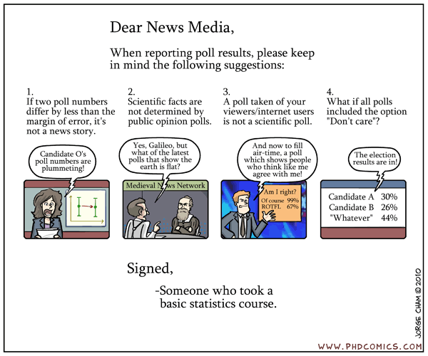
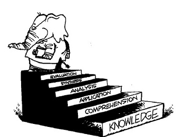
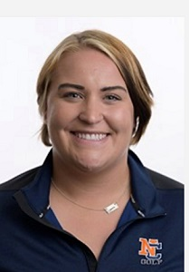
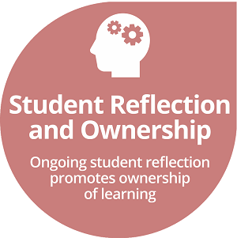

<ul>
  <li>How do we learn from raw data?</li>
  <li>How does statistics further science?</li>
  <li>How do I not get fooled by other people's numbers?</li>
</ul>

<figure>
  
  <figcaption>From <a href="http://phdcomics.com/comics/archive.php?comicid=1271" target="_blank">phdcomics.com</a></figcaption>
</figure>

 

What you learn in this <strong>Statistical Concepts and Analysis</strong> course will help you answer these questions.

----

## Syllabus Contents

* [Catalog Description](http://catalog.northland.edu/preview_course_nopop.php?catoid=19&coid=13534){:target="_blank"} and [Learning Outcomes](#learning-outcomes)
* [Assistance](#assistance) -- [Instructor](#instructor--derek-ogle), [Tutors](#tutors), [Accommodations](#accommodations), and [Academic Alerts](#academic-alerts)
* [Grading](#grading) -- [Preparation Checks](#preparation-checks), [Homework](#homework), [Engagement](#engagement), [Quizzes](#quizzes), [Overall Grade](#overall-grade)
* [Expectations](#expectations) -- [Ownership of Learning](#ownership-of-learning), [Work Outside of Class](#work-outside-of-class), [Classroom Conduct and Academic Integrity](#classroom-conduct-and-academic-integrity)

----

## Learning Outcomes

In this course, you will have the opportunity to:

1. Describe why statistics is central to scientific inquiry (& your field of interest); 
1. Define basic statistical words and symbols; 
1. Design simple **experiments** and **sampling** strategies; 
1. Perform appropriate **exploratory data analyses** (univariate and bivariate); 
1. Identify the purposes of and conduct and interpret the results of a **linear regression**; 
1. Construct and interpret confidence intervals for **one and two-sample mean and proportion** problems;
1. Identify the appropriate hypothesis test to perform in **one- and two-sample quantitative and categorical** data situations; 
1. Construct and interpret the results from a hypothesis test for **one- and two-sample quantitative and categorical** data situations; and 
1. Communicate statistical results and ideas in a succinct and informative manner. 

This course fulfills that Quantitative Reasoning requirement in the [General Education Program](https://my.northland.edu/faculty/fac-academic-programs/){:target="_blank"} because you will:

* Communicate mathematical information symbolically, visually, numerically, and verbally;
* Use statistical or mathematical models in solving problems; and
* Think critically about the validity of conclusions that are based on statistical or mathematical models.

----

## Assistance

> Don't be afraid to ask questions. Don't be afraid to ask for help when you need it. I do that every day. Asking for help isn't a sign of weakness, its a sign of strength. It shows you have the courage to admit when you don't know something, and to learn something new. -- President Barack Obama

### Instructor -- Derek Ogle

I am committed to your doing well in this course and see it as my responsibility to help you both in and out of the designated class period. I will be available in CSE228 whenever my door is open, but also specifically for office hours from 1-3p on Monday, Wednesday, and Friday. You can also anonymously ask me and other students questions on the [Piazza Class Discussion Site](https://piazza.com/northland/fall2020/mth107/home){:target="_blank"}, which I will monitor regularly ([here are directions of how to post a question](https://support.piazza.com/support/solutions/articles/48000574396-students-post-a-question)). Finally, you may send me [anonymous feedback, suggestions, or questions](https://www.surveymonkey.com/r/KC87PJW){:target="_blank"}. Please see or contact me if you have questions regarding this course.

### Tutors

TBD

<!---

Markia Smith will also be available to help you succeed in this course. Markia is a Math and Education major who took this class last year and will be tutoring for the first time this year. Markia is available on Thursdays from 6-8pm in CSE227 (the computer lab next to my office).

&nbsp;

&nbsp;

&nbsp;
--->

### Accommodations
I want to create an inclusive and accessible learning environment for those of you that have a condition (e.g., attention, learning, vision, hearing, mental, physical, or other health-related concern) that may require special accommodations. *If you have already established accommodations* with the Office of Accessibility Resources (OAR), please communicate your approved accommodations to me as soon as possible so that we can discuss your needs in this course. If you have a condition that requires accommodations but *you have not yet established services* through OAR, then you should contact Jennifer Newago as soon as possible (Ponzio 230, x1387, or <a href="mailto:accomodations@northland.edu">accomodations@northland.edu</a>). It is the policy and practice of Northland College to create inclusive and accessible learning environments consistent with federal and state law. <a href="https://my.northland.edu/life/be-healthy/accommodations/">More information is available here.</a>

### Academic Alerts
If I observe you "struggling" with the course early in the semester then I may file an "Academic Alert" about you. If this happens, you will receive an e-mail from me that will suggest steps you can take to improve your performance in the course. Our Academic Success Coordinator, Megan McPeak, will receive the alert and will likely also reach out to you. **Academic Alerts are not punitive**, they are simply an attempt to help you get back on track in this course as soon as possible.

----

## Course Workflow

The course is schedule to meet every weekday this term from 8-1130am. However, because of physical distancing guidelines, half of you will meet in the classrom from 815-945am and the other half will meet from 10-1130am. I will alternate weekly which groups will meet during which period.

This course is taught in a "flipped format", which loosely means that you will be responsible for obtaining factual content prior to coming to class and will then use class time with me to apply and expand upon what you learned prior to class. I have taught this class in this format for five years, largely because I believe the science that indicates that deeper learning is achieved with this model. However, this format also allows for teaching face-to-face, on-line, or a hybrid of both as necessary.

The course is composed of 25 modules of material which roughly corresponds to one module per day. Each module will follow this general format of instruction.

1. Prior to the class period dedicated to that module you will use written and video materials to answer a series of preparation questions about the module. These questions are listed below the "Preparation for Class" heading on each module webpage (see ["Foundational Definitions"](../modules/FoundationalDefns){:target="_blank"} as an example).
1. Betweeen 1pm on the day before and 8am on the day of the class period dedicated to that module complete the on-line "preparation quiz" related to the preparation questions. You may refer back to the readings and videos when answering these questions and you may ask relevant questions on the [Piazza webpage](https://piazza.com/configure-classes/fall2020/mth107){:target="_blank"}. The quiz, named by module and the "-- Prep Check" suffix, will be available on the [class Gradescope page](https://www.gradescope.com/courses/144614){:target="_blank"}. Graded quizzes will be returned to your Northland e-mail.
1. You will attend the class period where you will work on an assignment related to the module. The assignment is listed under the "Practice" section on the module webpage (see ["Foundational Definitions"](../modules/FoundationalDefns){:target="_blank"} as an example). The assignment can be typed or (neatly) hand-written and will be turned in to Gradescope by 8am the following day (the assignment will have the module name and "-- assignment" suffix. Gradescope requires a PDF of your assignment so you will need to create a PDF from your typed document or from pictures of your written work. In addition, you have to indicate which page in this document your answers on. [This resource](https://gradescope-static-assets.s3-us-west-2.amazonaws.com/help/submitting_hw_guide.pdf){:target="_blank"} demonstrates how to do upload your PDF to Gradescrope, including directions for "scanning" your work with types of phones. Graded assignments will be returned to your Northland e-mail and detailed answer keys will be placed on the module webpage.

----

## Grading

An overall grade will be computed from the items described below and in the <a href="#overall-grade">Overall Grade section</a> further below.

### Preparation Check Quizzes

Preparation check quizzes and due dates were described in the ["Course Workflow" section](#course-workflow). Quizzes not completed by the due date time will not be accepted. Your lowest three quizzes, however, will be dropped when computing your grade.

### Assignments

Assignments and due dates were described in the ["Course Workflow" section](#course-workflow). Assignments not completed by the due date time will not be accepted. Your lowest three quizzes, however, will be dropped when computing your grade.

### Final Exam
A final exam will give you an opportunity to show that you have a synthetic understanding of all material from throughout the course. The final exam will be focused on larger concepts, applications, and interpretations (rather than specific details) from throughout the semester. I will provide you with an explicit study guide approximately one week before the final exam.

### Overall Grade
An overall score will be computed from the items and associated weights listed in the table below (and described above). To compute your current grade, enter your percentage scores in the boxes for completed assessments. Grades on individual preparation check quizzes and assignments can be found on the [class Gradescope page](https://www.gradescope.com/courses/144614){:target="_blank"}. To project your future grade, also include percentages for future assessments.

<!-- if the assessment weights change then you must change the values in get_wghts() in the grader.js file -->

<form name="GRADECALC">
<table class="grader" width="90%">
<tr><th width="15%"></th>
<th width="28%"><a href="#preparation-check-quizzes">Prep Check Quizzes</a></th>
<th width="28%"><a href="#assignments">Assignments</a></th>
<th width="29%"><a href="#quizzes">Final Exam</a></th>
</tr>

<tr><th>Weight</th><th>25%</th><th>50%</th><th>25%</th></tr>

<tr><th>Percent</th>
<td><input type="text" name="PREP_SC" size="3" tabindex="1" onchange="calc_grade(this.form)"></td>
<td><input type="text" name="HW_SC" size="3" tabindex="2" onchange="calc_grade(this.form)"></td>
<td><input type="text" name="FNL_SC" size="3" tabindex="3" onchange="calc_grade(this.form)"></td>
</tr>

<tr><th colspan="2">Overall: <input type="text" name="SCORE" size="4"></th>
<th colspan="2">Grade: <input type="text" name="GRADE" size="2"></th></tr>
</table>
</form>

Your letter grade will be assigned from your overall percentage (rounded to a whole number) and the table below.

<table class="tg">
  <tr><td></td><td>A 92-100</td><td>A- 90-91</td></tr>
  <tr><td>B+ 87-89</td><td>B  82-86</td><td>B- 80-81</td></tr>
  <tr><td>C+ 77-79</td><td>C  70-76</td><td></td></tr>
  <tr><td>D+ 67-69</td><td>D  60-66</td><td>F   0-59</td></tr>
</table>

#### Note About Incomplete Grades
An incomplete grade will be given ONLY in extreme circumstances that are beyond your control, such as a major illness, and will ONLY be given if you have successfully completed the entire course except for the final exam. This is in accordance with [Northland College policy](https://my.northland.edu/student-policies/academic-policies/#grades){:target="_blank"} (scroll down to "Incomplete Grades").

#### Note About Midterm Grades
I will submit a "midterm grade" for you approximately half-way through the semester. This grade will by my best guess at your lowest possible final grade. I assign this "worst-case" midterm grade because I believe that it is better to know the worst rather than the best-case scenario at that point of the semester and the material at the end of the semester is a little more difficult than the material at the beginning of the semester. Of course, see me if you have questions about your midterm grade.

----

## Expectations

### Ownership of Learning

This course is designed in a way that you will have to actively, rather than passively, engage in the course content. In this way, it may differ from some of your other courses. In particular, in this course you will need to:

* Interact with the course material on a near daily basis (i.e., you will not be able to ignore the class for several days).
* Multi-task material from multiple modules (i.e., you may be finishing exercises for one module while preparing for class on another module).
* Prepare for some course content on your own prior to class. See [Preparation Checks](#preparation-checks) section above and [Work Outside of Class](#work-outside-of-class) section below.
* Assess your own performance on daily exercises by comparing your answers to an answer key (which will also contain hints related to common mistakes).
* Do more than what is required to be turned in for a grade (i.e., you will likely need more practice than the few exercises that are turned in for a grade; thus, more exercises are provided in most modules).
* Ask for help from me (the professor) both during and outside of class. See [Assistance](#assistance) section above.
* Maintain focus for an extended period of time (1.5 h for each class, 2 h for quizzes).

### Work Outside of Class

As a general rule-of-thumb[^2], you are expected to spend 2-3 hours of time outside of class for each hour in class. This course meets for 4.5 hours per week and, thus, you should dedicate between 9 and 13.5 hours of time outside of class preparing for class, completing review and class exercises, and studying for quizzes. **The work required for this course can be completed within this expected amount of time, if that time is without distraction**. If monitoring your phone/device is distracting you from getting your work done then you may consider the aid of apps (e.g., [Forest](https://www.forestapp.cc/)) designed to reduce distractions from devices.[^DistractionAids]  

If you feel that you are spending too much time on some exercises or preparations because you are "stuck," then start your work earlier so that you can stop (and do other things) and make plans to see [me](#instructor--derek-ogle) or the [tutors](#tutors) for help.

### Classroom Conduct and Academic Integrity

My intent is to create a classroom environment where solid learning of statistics can occur. One part of this environment is a well-organized course structure built upon relevant learning resources and interesting realistic exercises. Another part is my availability to assist you in learning from these resources and exercises. A third part is your conduct within the classroom. My expectations of you are that you will fully engage in the course (see above) and be respectful of all others in the class. At a minimum, I expect you to adhere to the following behaviors:

* Please arrive to class on time. If you arrive late, then take the first available seat as quietly as possible. If you need to leave early, then please sit near the exit.
* Please attend the entire class period. Leaving class early defeats the purpose of the class period, does not take advantage of resources (i.e., the professor) that can significantly help your learning, and does not build statistical stamina. Please take care of your personal needs (e.g., using the restroom) before class so that you can stay focused for the entire class period.
* Please turn your computer on immediately so that you can promptly begin the daily preparation check.
* Please limit computer use to class work.
* Please **do not use your own computer** during class unless you clear it with me at the beginning of the semester.
* Please turn off and store out-of-sight cell phones and other electronic devices.
* Please **do not listen to music** (or otherwise wear ear buds) during class.
* Please do not have side discussions while I or others are speaking to the entire class.
*	Please do not sleep in class -- this is rude and distracting to others.
* Please do not use disrespectful language when addressing others.

Finally, note that the [College's Academic Integrity Statement & Policy](https://my.northland.edu/student-policies/academic-policies/#academic-integrity){:target="_blank"} will be followed in this course. Please make sure that you are familiar with its content.

----

### Footnotes

[^email]: While I am pretty open-minded and not much of a stickler when it comes to e-mail etiquette, some professors are. And it is always better to send an appropriate rather than an inappropriate e-mail. [Here](https://www.scribendi.com/advice/how_to_email_a_professor.en.html) and [here](https://www.insidehighered.com/views/2015/04/16/advice-students-so-they-dont-sound-silly-emails-essay) are some good suggestions for e-mailing professors.

[^2]: General advice for how much time should be spent outside of class for each hour inside of class can be found, among many, [here](https://www.collegeparentcentral.com/2010/02/is-your-college-student-investing-enough-time-studying/){:target="_blank"}, [here](http://classroom.synonym.com/ratio-studying-class-time-college-1075.html){:target="_blank"}, [here](https://www.usu.edu/asc/studysmart/pdf/estimating_study_hours.pdf){:target="_blank"}, and [here](http://collegelife.about.com/od/academiclife/f/How-Much-Time-Should-I-Spend-Studying-In-College.htm){:target="_blank"}.

[^DistractionAids]: Also see the following resources for other apps that may help you eliminate distractions from your devices ... [here](https://georgehalachev.com/2019/01/15/7-apps-that-will-help-you-beat-procrastination/){:target="_blank"}, [here](https://www.careercontessa.com/advice/best-apps-chronic-procrastinator/){:target="_blank"}, [here](https://highschoolhints.com/6-apps-that-will-stop-your-procrastinating/){:target="_blank"}, or [here](https://remotebliss.com/procrastination-apps/){:target="_blank"}.
