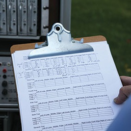
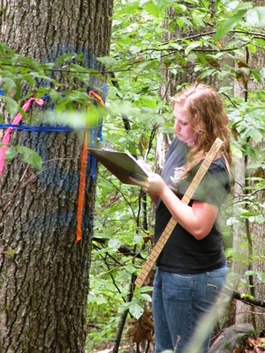

----

* [Extent](#extent)
* [Data Collection](#data-collection)
* [Proposal](#proposal)
* [Exploratory Data Analysis](#exploratory-data-analysis)
* [Hypothesis Testing](#hypothesis-testing)
* [Past Projects](#past-projects)

----

## Introduction
The “term project” is a brief statistical study to answer a question of interest to you.  In this project, you will formulate a research question (and statistical hypotheses), develop a data production strategy, collect data, perform relevant analyses to answer the question, and produce a document that details your findings.  More specific information about the project is below.

## Extent

Your[^1] project should provide an opportunity for you to demonstrate your proficiency in (i) producing data, (ii) performing EDAs, and (iii) performing hypothesis tests.  Thus, you should develop a question of interest to you (and me[^2]) that will require you to record at least one variable on individuals sampled from at least two populations such that your question may be answered with one of the “two-or-more samples” hypothesis tests that you will learn in this class (i.e., 2-sample t- or chi-square tests)[^3].  Past project titles and some reports (as examples) are [shown below](past-projects).

[^1]: You may work with one other person, but the project will need to be more involved (e.g., larger sample) or complex (e.g., multiple questions).
[^2]: Questions about the colors of candies and who lives in which residence hall are not interesting to me!
[^3]: Research questions that may be answered with linear regression or one of the 1-sample methods may be considered but I will need to pre-approve these projects (i.e., you will need to make a strong argument for why your proposed study is of great interest to you).

## Data collection

Proper data collection methods (i.e., randomization) should be used if possible.  If proper methods cannot be used, then this must be acknowledged and the reasoning for using the less than proper methods explained.

## Proposal

Before beginning your project you must submit a typed proposal to me.  This proposal should contain:

* your research question (including a brief description of why this question is of interest),
* identification of the individual, variable(s), and population(s) you will study, and
* a thorough description of how you will collect your data.

Your proposal is due in the fourth week (see [Due Dates page](../calendar.html){:target="_blank"}).  I will review your proposal within the context of correctness and efficiency.  You may be required to submit a corrected proposal.  The proposal is worth **10%** of the overall project grade.

## Exploratory Data Analysis

The initial project report will include a thorough univariate EDA for each variable, a thorough univariate EDA for your response variable separated by each group, and appropriate bivariate EDAs.  Your analyses should be typed, carefully written (concise and grammatically correct), and refer to graphs and tables as appropriate.

Your EDA write-up is due in the tenth week (see [Due Dates page](../calendar.html){:target="_blank"}).  This report is worth **30%** of the overall project grade.

## Hypothesis Testing

The final project report will include a thorough statistical analysis of your research question.  Specifically, your report should include:

* **Introduction:** background information needed to understand the project, why the results are important to people, why you were interested in the project, and what the objectives of the study were (i.e., the research question).
* **Methods:** describe the methodology you used to collect and analyze the data.
* **Results:** the results from your 11-steps of hypothesis testing.
* **Discussion:** a summary of what you found in the results and how it relates to your reasoning from the introduction.  Also include any items that you would change if you were to analyze this research question again or what direction future research on this topic should follow.
* **Works cited:** list of references (if any) used to support your project.
* **R Appendix:** all relevant and working R commands.
* **Other Appendix:** other relevant materials (e.g., survey instrument) as necessary.

This final write-up is due in the fourteenth week (see [Due Dates page](../calendar.html){:target="_blank"}).  This report is worth **60%** of the overall project grade.

## Past Projects

Titles (with links to some final reports) of projects that students in past semesters have completed are [found here](past-projects/).  Note that the directions for these past projects were different and these reports did not receive perfect scores.  Thus, use these as examples for the scope of the project and the level of write-up but refer to the directions above for specific instructions for your project.

----

## Footnotes
